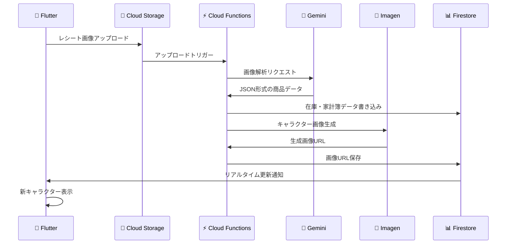
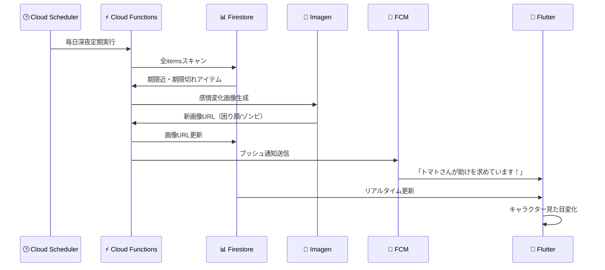

# 🍅 冷蔵庫管理 AI アプリ - システムアーキテクチャ設計書

## 📋 概要

このドキュメントは、Flutter と GCP の強みを最大限に活かした冷蔵庫管理 AI アプリのベストアーキテクチャを定義します。

### 🎯 設計コンセプト

**「スマートクライアント・インテリジェントクラウド」モデル**

- **フロントエンド（Flutter）**: UI とユーザー操作に特化
- **バックエンド（GCP）**: AI 処理、データ永続化、ビジネスロジックを集約

## 🏗️ 全体アーキテクチャ構成図

```mermaid
graph TD
    subgraph "📱 ユーザーデバイス"
        A[Flutterアプリ<br/>UI/UX, Riveアニメーション<br/>ML Kitオンデバイス処理]
    end

    subgraph "🔥 Firebase (BaaS for Mobile)"
        B[Authentication<br/>ユーザー認証・家族管理]
        C[Firestore<br/>リアルタイムDB<br/>(在庫/レシピ/ユーザー情報)]
        D[Cloud Storage<br/>画像ストレージ<br/>(レシート/生成キャラ画像)]
        E[FCM<br/>プッシュ通知]
    end

    subgraph "☁️ Google Cloud (Backend & AI Brain)"
        F[Cloud Functions<br/>イベント駆動バックエンド<br/>(DBトリガー/スケジュール実行)]
        G[Cloud Run<br/>APIエンドポイント<br/>(Flutterからの直接呼び出し)]
        H[Vertex AI - Gemini<br/>AIエージェント<br/>(レシピ提案/レシート解析/対話)]
        I[Vertex AI - Imagen<br/>画像生成<br/>(食材キャラクター作成)]
        J[BigQuery<br/>データ分析基盤<br/>(家計簿/フードロス分析)]
        K[Looker Studio<br/>データ可視化ダッシュボード]
    end

    subgraph "🌐 外部サービス"
        L[Open Food Facts API<br/>商品情報マスタ]
    end

    %% データフロー
    A --> B
    A --> C
    A --> D
    A --> G

    G --> F
    F --> H
    F --> I
    F --> J
    F --> L

    C --> F
    D --> F

    F --> B
    F --> C
    F --> D
    F --> E
    E --> A
```

## 🧩 各コンポーネントの役割

### 📱 フロントエンド: Flutter

**役割**: ユーザーが直接触れるすべての UI と UX を担当

**実装詳細**:

- **UI フレームワーク**: Flutter
- **アニメーション**: 食材キャラクターや冷蔵庫内のインタラクティブ表現に Rive を使用
- **バーコード読取**: オンデバイス高速動作の**Google ML Kit (Barcode Scanning)**を使用

### 🔥 認証・DB・ストレージ: Firebase Suite

#### 🔐 Firebase Authentication

- メール、Google/Apple サインインを提供
- 家族単位でのユーザー管理の基盤

#### 📊 Firestore

- アプリのメインデータベース
- 在庫、買い物リスト、ユーザー設定などをリアルタイム同期
- 家族間での共同編集とオフライン機能をサポート

#### 📁 Cloud Storage for Firebase

- レシート写真とキャラクター画像の保存
- Imagen が生成した画像のストレージ

#### 📢 Firebase Cloud Messaging (FCM)

- 賞味期限リマインド
- AI からの提案をプッシュ通知で配信

### ⚡ バックエンドロジック: Cloud Functions & Cloud Run

#### 🔄 Cloud Functions

**イベント駆動処理の心臓部**

トリガー条件:

- Firestore のデータ更新時（食材追加など）
- Cloud Storage への画像アップロード時（レシート撮影など）
- 定期実行（賞味期限チェックなど）

#### 🌐 Cloud Run

- Flutter アプリからの HTTP リクエスト受付
- レシピ提案など、ユーザー能動的アクションの窓口

### 🤖 AI 頭脳: Vertex AI

#### 🧠 Vertex AI - Gemini API

**アプリの AI エージェント（Function Calling 機能活用）**

主要機能:

- **レシート解析**: OCR テキストから商品名、数量、価格を構造化データに変換
- **レシピ提案**: 現在の在庫から栄養バランスの良いレシピを提案
- **賞味期限推定**: 商品写真やパッケージ文字列から賞味期限を読み取り

#### 🎨 Vertex AI - Imagen API

**食材キャラクター画像生成専門**

特徴:

- 「元気な笑顔のトマトのキャラクター、ステッカー風」等のプロンプトで画像生成
- 生成画像を Cloud Storage にキャッシュしてコスト最適化

### 📈 データ分析: BigQuery & Looker Studio

#### 📊 BigQuery

- 食材の購入・消費・廃棄イベントログを蓄積
- 家計簿データとフードロス統計の基盤

#### 📉 Looker Studio

- 「今月の食費」「廃棄の多い食材カテゴリ」等を可視化
- データ駆動インサイトをダッシュボード提供

### 🌐 外部商品 DB: Open Food Facts API

- バーコードからの商品情報取得（第一情報源）
- 世界中の食品情報を無料で利用
- API 取得失敗時のみユーザー手動入力を促す

## 🔄 主要な処理フロー

### 📱➡️☁️ フロー 1: レシート撮影による一括登録



**詳細ステップ:**

1. **Flutter**: ユーザーがレシートを撮影し、Cloud Storage にアップロード
2. **Cloud Functions**: Storage アップロードをトリガーに起動
3. **Functions → Gemini**: レシート画像を解析し、JSON 形式で商品データを抽出
4. **Functions → Firestore**: 在庫（items）と家計簿（receipts）コレクションに一括書き込み
5. **Functions → Imagen**: 新食材の「元気な ○○」キャラクター画像を生成
6. **Flutter**: Firestore リアルタイム更新を検知し、新キャラクターを自動表示

### ⏰➡️😰 フロー 2: 賞味期限による感情変化



**詳細ステップ:**

1. **Cloud Scheduler**: 毎日深夜に定期実行
2. **Functions → Firestore**: 全 items をスキャンし期限チェック
3. **Functions → Imagen**:
   - 期限近: 「困り顔の ○○」画像生成
   - 期限切れ: 「ゾンビ化した ○○」画像生成
4. **Functions → Firestore/FCM**: 画像 URL 更新 + プッシュ通知送信
5. **Flutter**: 更新された画像でキャラクター表示変更

## 📊 Firestore データモデル設計

```yaml
collections:
  # 👨‍👩‍👧‍👦 家族・世帯グループ
  households:
    - { householdId }:
        name: "〇〇家の冷蔵庫"
        members: ["userId1", "userId2"]
        createdAt: "2024-09-01T00:00:00Z"
        settings:
          notificationEnabled: true
          expiryWarningDays: 3

  # 👤 ユーザー情報
  users:
    - { userId }:
        displayName: "ユーザー名"
        email: "user@example.com"
        householdId: "householdId"
        role: "owner" # owner, member
        joinedAt: "2024-09-01T00:00:00Z"

  # 🥕 冷蔵庫の中の個別の食材アイテム
  items:
    - { itemId }:
        householdId: "householdId"
        productName: "トマト"
        category: "野菜"
        quantity: 3
        unit: "個"
        purchaseDate: "2024-09-20T00:00:00Z"
        expiryDate: "2024-09-30T00:00:00Z"
        owner: "userId1" # 「私のプリン！」機能用
        status: "fresh" # fresh, soon, expired
        barcode: "4901234567890"
        price: 300
        imageUrls:
          fresh: "gs://bucket/tomato_fresh.png"
          soon: "gs://bucket/tomato_soon.png"
          expired: "gs://bucket/tomato_expired.png"
        addedBy: "userId1"
        lastUpdated: "2024-09-20T00:00:00Z"

  # 🧾 レシート情報（家計簿用）
  receipts:
    - { receiptId }:
        householdId: "householdId"
        storeName: "〇〇スーパー"
        storeAddress: "東京都○○区..."
        purchaseDate: "2024-09-20T15:30:00Z"
        totalAmount: 2580
        taxAmount: 258
        receiptImageUrl: "gs://bucket/receipt_12345.jpg"
        items:
          - productName: "トマト"
            quantity: 3
            unitPrice: 100
            totalPrice: 300
        addedBy: "userId1"
        processedAt: "2024-09-20T15:35:00Z"

  # 📝 買い物リスト
  shoppingLists:
    - { listId }:
        householdId: "householdId"
        name: "今週の買い物"
        items:
          - productName: "牛乳"
            quantity: 1
            priority: "high"
            addedBy: "userId1"
            checked: false
        createdBy: "userId1"
        createdAt: "2024-09-20T00:00:00Z"
```

## 🎯 まとめ

このアーキテクチャは、**Firebase のリアルタイム性**と**GCP の強力な AI サービス**を組み合わせることで、以下を実現します：

- ⚡ **高速な開発**: Firebase BaaS による迅速なプロトタイピング
- 🚀 **高いスケーラビリティ**: GCP サーバーレス環境による自動スケーリング
- 😊 **最高のユーザー体験**: AI キャラクターとリアルタイム同期による楽しい体験
- 💰 **コスト最適化**: サーバーレス + キャッシュ戦略による効率的運用

この設計により、家族みんなで楽しめる次世代冷蔵庫管理アプリの構築が可能となります。
