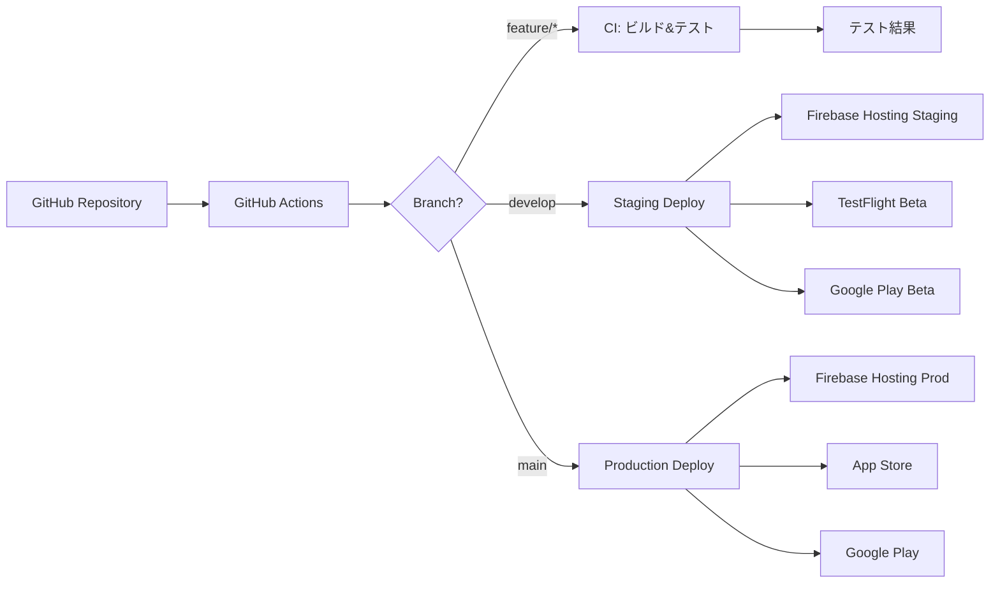

# 🚀 CI/CDパイプライン設計書

## 概要

このドキュメントは、GCP Hackathon F06プロジェクトのCI/CDパイプライン設計について説明します。
GitHub Actionsを使用して、Flutter iOS/Android/Webアプリケーションの自動ビルド、テスト、デプロイを実現します。

## アーキテクチャ



## ワークフロー構成

### 1. 継続的インテグレーション (CI)

**ファイル**: `.github/workflows/ci.yml`  
**トリガー**: 
- Push to `main`, `develop`, `feature/*`
- Pull Request to `main`, `develop`

**ジョブ**:
- **flutter_analyze**: コード静的解析
- **flutter_test**: ユニット&ウィジェットテスト
- **build_web**: Webビルド検証
- **build_ios**: iOSビルド検証
- **build_android**: Androidビルド検証

### 2. Webデプロイメント

**ファイル**: `.github/workflows/deploy-web.yml`  
**トリガー**: 
- Push to `develop` → Staging環境
- Push to `main` → Production環境

**ステップ**:
1. Flutter Web ビルド
2. Firebase Hosting デプロイ
3. Cloud Functions デプロイ
4. Lighthouse パフォーマンス測定

### 3. モバイルアプリ配信

**ファイル**: `.github/workflows/deploy-mobile.yml`  
**トリガー**: 
- Push to `develop` → Beta配信
- Push to `main` → Store審査提出
- Manual trigger → 緊急リリース

**iOS デプロイ**:
1. 証明書&プロビジョニングプロファイル設定
2. Xcodeビルド (.ipa生成)
3. TestFlight/App Store Connect アップロード

**Android デプロイ**:
1. Keystoreセットアップ
2. App Bundle (.aab) ビルド
3. Google Play Console アップロード

### 4. セキュリティスキャン

**ファイル**: `.github/workflows/security.yml`  
**トリガー**: 
- 毎日午前3時 (cron)
- Pull Request
- Manual trigger

**チェック項目**:
- 依存関係の脆弱性 (Dependabot)
- シークレット漏洩検出
- SAST (Static Application Security Testing)
- コンテナイメージスキャン

## 環境変数とシークレット

### GitHub Secrets設定

```yaml
# Firebase関連
FIREBASE_SERVICE_ACCOUNT_PROD    # 本番環境サービスアカウント
FIREBASE_SERVICE_ACCOUNT_STAGING # ステージング環境サービスアカウント

# iOS関連
IOS_CERTIFICATE_BASE64           # p12証明書 (Base64)
IOS_CERTIFICATE_PASSWORD         # 証明書パスワード
IOS_PROVISION_PROFILE_BASE64     # プロビジョニングプロファイル
APP_STORE_CONNECT_API_KEY        # App Store Connect API
APP_STORE_CONNECT_API_ISSUER     # API発行者ID

# Android関連
ANDROID_KEYSTORE_BASE64          # Keystore (Base64)
ANDROID_KEYSTORE_PASSWORD        # Keystoreパスワード
ANDROID_KEY_ALIAS                # Key alias
ANDROID_KEY_PASSWORD             # Key password
GOOGLE_PLAY_SERVICE_ACCOUNT      # Play Console API

# 通知関連（オプション）
SLACK_WEBHOOK_URL                # Slack通知用
```

## ブランチ戦略との統合

| ブランチ | CI実行 | デプロイ先 | 環境 |
|---------|--------|-----------|------|
| `feature/*` | ✅ ビルド&テスト | なし | 開発者ローカル |
| `develop` | ✅ ビルド&テスト | Staging | テスト環境 |
| `main` | ✅ ビルド&テスト | Production | 本番環境 |
| `hotfix/*` | ✅ ビルド&テスト | なし | 緊急修正用 |

## デプロイメントフロー

### Web (Firebase Hosting)

```bash
# Staging (develop branch)
develop → Build → Deploy to staging.gcp-f06-barcode.web.app

# Production (main branch)
main → Build → Deploy to gcp-f06-barcode.web.app
```

### iOS (App Store)

```bash
# Beta (develop branch)
develop → Build → TestFlight → Internal Testing

# Release (main branch)  
main → Build → TestFlight → External Testing → App Store Review → Release
```

### Android (Google Play)

```bash
# Beta (develop branch)
develop → Build → Internal Testing Track

# Release (main branch)
main → Build → Closed Testing → Open Testing → Production
```

## パフォーマンス指標

### ビルド時間目標

- **CI実行時間**: < 10分
- **Webデプロイ**: < 5分
- **iOSビルド**: < 15分
- **Androidビルド**: < 10分

### 品質ゲート

- **コードカバレッジ**: > 80%
- **Lighthouseスコア**: > 90
- **静的解析エラー**: 0
- **セキュリティ脆弱性**: Critical/High = 0

## 監視とアラート

### 成功/失敗通知

- **Slack通知**: ビルド結果、デプロイ状況
- **メール通知**: セキュリティアラート
- **GitHub Status**: PR状態更新

### ダッシュボード

- GitHub Actions履歴
- Firebase Console (Crashlytics, Performance)
- App Store Connect (クラッシュレート)
- Google Play Console (ANR、クラッシュ)

## トラブルシューティング

### よくある問題と解決策

1. **iOSビルドエラー**
   - 証明書の有効期限確認
   - プロビジョニングプロファイル更新
   - Xcode/Flutter SDKバージョン確認

2. **Androidビルドエラー**
   - Keystoreファイル確認
   - Gradle依存関係クリア
   - minSdkVersion互換性

3. **Firebaseデプロイエラー**
   - サービスアカウント権限確認
   - プロジェクトID確認
   - Firebase CLIバージョン

## メンテナンス

### 定期作業

- **週次**: 依存関係アップデート確認
- **月次**: 証明書有効期限確認
- **四半期**: SDKメジャーバージョンアップ

### バックアップ

- 証明書/Keystoreの安全な保管
- サービスアカウントキーのローテーション
- ワークフロー設定のバージョン管理

## 参考リンク

- [GitHub Actions Documentation](https://docs.github.com/actions)
- [Flutter CI/CD Best Practices](https://docs.flutter.dev/deployment/cd)
- [Firebase Hosting GitHub Action](https://github.com/FirebaseExtended/action-hosting-deploy)
- [Fastlane for Mobile](https://fastlane.tools/)