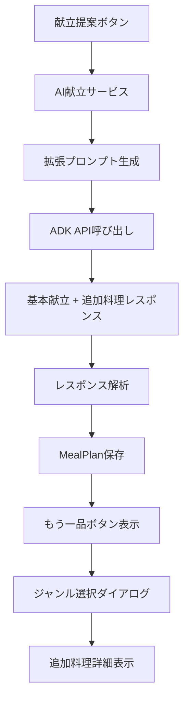

# 「もう一品」機能強化 - 実装ガイド

## 📋 プロジェクト概要

**目標**: 献立提案時にADKで全ジャンル（主菜・副菜・汁物・おつまみ）の追加料理を事前生成し、ユーザーが選択したジャンルに応じて即座に料理を表示する機能を実装する

**期間**: 2-3日間

**複雑度**: ⭐⭐⭐⭐☆ (やや高)

## 🎯 機能要件

### 現在の問題点
- ✅ UIは実装済みだが、スタブ実装で実際の料理生成なし
- ❌ ユーザー選択後に生成するため応答が遅い（現在は2秒のダミー待機）
- ❌ 生成された料理の保存・表示機能なし
- ❌ ADK APIとの連携が未実装

### 実装後の機能
1. **事前生成機能** - 献立提案時に追加料理も同時生成
2. **即座表示** - 選択したジャンルの料理を即座に表示
3. **詳細表示** - 料理名、説明、材料、レシピ、栄養情報の表示
4. **冷蔵庫連携** - 現在の食材に基づく最適な追加料理提案

## 🏗️ 実装アーキテクチャ

### データフロー


### 主要コンポーネント
```yaml
data_layer:
  - MealPlan: "追加料理フィールド拡張"
  - Firestore: "追加データ保存"

service_layer:
  - AIMealPlanningService: "拡張プロンプト・解析機能"
  - ADK API: "全ジャンル同時生成"

presentation_layer:
  - AdditionalDishDisplayDialog: "追加料理詳細表示"
  - Enhanced Selection Dialog: "強化されたジャンル選択"
```

## 📋 実装計画

### Phase 1: データモデル拡張 【0.5日】

#### 1.1 MealPlanモデル修正
**ファイル**: `lib/shared/models/meal_plan.dart`

**追加フィールド**:
```dart
// 新規フィールド
final Map<String, MealItem>? additionalDishes; // 追加料理マップ
final bool additionalDishesGenerated; // 生成済みフラグ
final DateTime? additionalDishesGeneratedAt; // 生成日時
```

**新規メソッド**:
```dart
MealItem? getAdditionalDish(String dishType)
bool hasAdditionalDish(String dishType)
List<String> get availableAdditionalDishTypes
int get additionalDishCount
```

**実装のポイント**:
- 既存データとの互換性維持
- Firestore変換メソッドの拡張
- null安全性の確保

### Phase 2: AI サービス拡張 【1日】

#### 2.1 拡張プロンプト実装
**ファイル**: `lib/core/services/ai_meal_planning_service.dart`

**拡張内容**:
```yaml
prompt_enhancement:
  - basic_meals: "主菜・副菜・汁物・主食"
  - additional_dishes: "追加主菜・追加副菜・追加汁物・おつまみ"
  - ingredient_optimization: "冷蔵庫食材の効率的活用"
  - variety_assurance: "基本料理との重複回避"
```

**新規メソッド**:
```dart
String _buildExtendedMealPlanPrompt(List<Ingredient>, UserPreferences)
MealPlan _parseExtendedMealPlanResponse(String, String, List<Ingredient>)
```

#### 2.2 レスポンス解析強化
**対応するJSONスキーマ**:
```json
{
  "basicMeals": { /* 基本4品 */ },
  "additionalDishes": {
    "additionalMainDish": { /* 追加主菜 */ },
    "additionalSideDish": { /* 追加副菜 */ },
    "additionalSoup": { /* 追加汁物 */ },
    "snack": { /* おつまみ */ }
  },
  "shoppingList": { /* 買い物リスト */ },
  "mealPlanSummary": { /* 献立サマリー */ }
}
```

### Phase 3: UI機能実装 【1日】

#### 3.1 追加料理詳細ダイアログ
**新規ファイル**: `lib/features/meal_planning/presentation/widgets/additional_dish_display_dialog.dart`

**機能**:
- 料理名・説明表示
- 調理時間・難易度・カロリー表示
- 材料リスト（利用可能性表示）
- レシピ手順表示
- 献立追加ボタン

#### 3.2 既存UI強化
**修正ファイル**: `lib/features/meal_planning/presentation/pages/meal_plan_screen.dart`

**修正内容**:
```dart
// スタブ実装を実機能に置き換え
Future<void> _addAdditionalDish(String dishType) async {
  // 事前生成された料理を取得・表示
}

// 選択ダイアログの強化
void _suggestAdditionalDish(MealPlan mealPlan) {
  // 利用可能な追加料理の動的表示
}
```

### Phase 4: 統合テスト・最適化 【0.5日】

- 完全フローテスト
- エラーハンドリング確認
- パフォーマンス最適化
- UI/UX調整

## 🎨 デザインシステム

### カラーパレット（既存と統一）
```dart
static const Color _baseColor = Color(0xFFF6EACB);     // クリーム色
static const Color _primaryColor = Color(0xFFD4A574);   // 温かいベージュ
static const Color _accentColor = Color(0xFF8B7355);    // ブラウン
static const Color _textColor = Color(0xFF5D4E37);      // ダークブラウン
```

### UIコンポーネント
```yaml
additional_dish_dialog:
  layout: "スクロール可能なダイアログ"
  header: "ジャンル表示 + 料理名 + 閉じるボタン"
  content: "説明 + 調理情報 + 材料 + レシピ"
  actions: "閉じる + 献立に追加"

selection_dialog_enhancement:
  dynamic_options: "生成済み料理の動的表示"
  preview_info: "料理名 + 調理時間 + 簡単な説明"
  visual_indicators: "利用可能性の視覚表示"
```

## 🔧 技術仕様

### データ保存スキーマ
```yaml
firestore_meal_plans:
  additional_fields:
    additionalDishes:
      type: "Map<String, Object>"
      structure: "ジャンル名 -> MealItemデータ"
    additionalDishesGenerated:
      type: "boolean"
      default: false
    additionalDishesGeneratedAt:
      type: "timestamp"
      nullable: true
```

### パフォーマンス考慮
```yaml
optimization_strategies:
  generation_time:
    - current: "基本献立のみ 3-5秒"
    - enhanced: "追加料理含む 4-7秒"
    - target: "増加率50%以下"
  
  memory_usage:
    - additional_data: "~20KB"
    - ui_components: "~10MB"
    - target: "総増加30MB以下"
  
  response_time:
    - selection_to_display: "< 500ms"
    - dialog_rendering: "< 300ms"
```

### エラーハンドリング
```yaml
error_scenarios:
  generation_failures:
    - ai_timeout: "部分生成での継続"
    - invalid_response: "フォールバック処理"
    - network_error: "適切なエラー表示"
  
  data_issues:
    - missing_fields: "デフォルト値での補完"
    - save_failure: "ローカルキャッシュ + 再試行"
  
  ui_errors:
    - dialog_failure: "スナックバーでの代替表示"
    - image_load_error: "プレースホルダー表示"
```

## 🧪 テスト戦略

### 単体テスト
```dart
// MealPlanモデルのテスト
test/shared/models/meal_plan_test.dart
- getAdditionalDish()
- hasAdditionalDish()
- availableAdditionalDishTypes
- Firestore変換メソッド

// AIサービスのテスト
test/core/services/ai_meal_planning_service_test.dart
- 拡張プロンプト生成
- レスポンス解析
- エラーハンドリング

// UIコンポーネントのテスト
test/features/meal_planning/presentation/widgets/additional_dish_display_dialog_test.dart
- ダイアログ表示
- ユーザーインタラクション
- データ表示
```

### 統合テスト
```dart
integration_test/additional_dish_flow_test.dart
- 献立生成 → 追加料理生成 → 表示 → 詳細表示の完全フロー
- エラーケースのハンドリング
- パフォーマンステスト
```

### テストシナリオ
1. **正常フロー**: 献立生成 → 4種類追加料理生成 → 選択 → 詳細表示
2. **部分生成**: 一部追加料理生成失敗 → 利用可能分のみ表示
3. **完全失敗**: 追加料理生成失敗 → 適切なエラー表示
4. **ネットワークエラー**: 通信失敗時の適切な処理

## 📊 成功指標

### 機能指標
- ✅ 献立生成時に4種類の追加料理が生成される
- ✅ 選択したジャンルの料理詳細が即座に表示される
- ✅ 材料の利用可能性が正確に表示される
- ✅ 冷蔵庫食材に基づく最適な料理が提案される

### パフォーマンス指標
- ✅ 追加料理選択から表示まで < 500ms
- ✅ 献立生成時間の増加 < 50%
- ✅ メモリ使用量の増加 < 30MB
- ✅ エラー率 < 1%

### ユーザビリティ指標
- ✅ 既存UIとの統一性
- ✅ 直感的な操作性
- ✅ 適切な情報表示
- ✅ エラー時の分かりやすいガイダンス

## 🚀 実装手順

### 1. 環境準備
```bash
# プロジェクトディレクトリに移動
cd /Users/takenakashun/Desktop/GCP-hackathon/GCP-Hackathon-F06

# 依存関係確認
flutter pub get

# 現在の実装確認
flutter test
```

### 2. Phase 1: データモデル拡張
1. `MealPlan`クラスに新規フィールド追加
2. 新規メソッド実装
3. Firestore変換メソッド修正
4. 単体テスト作成・実行

### 3. Phase 2: AI サービス拡張
1. 拡張プロンプト実装
2. レスポンス解析機能強化
3. エラーハンドリング実装
4. サービステスト実行

### 4. Phase 3: UI実装
1. `AdditionalDishDisplayDialog`作成
2. 既存UI修正（`_addAdditionalDish`等）
3. デザイン統一性確認
4. UIテスト実行

### 5. Phase 4: 統合・最適化
1. 完全フローテスト
2. パフォーマンス測定・最適化
3. エラーケーステスト
4. 最終調整

## 🔍 トラブルシューティング

### よくある問題

#### 1. AI生成エラー
```yaml
問題: "追加料理の生成に失敗する"
原因: 
  - プロンプトが長すぎる
  - ADK APIのレスポンス制限
  - ネットワークタイムアウト
解決:
  - プロンプト最適化
  - タイムアウト設定調整
  - 段階的生成の実装
```

#### 2. データ保存エラー
```yaml
問題: "Firestoreへの保存に失敗する"
原因:
  - データサイズ制限
  - ネットワーク接続問題
  - 権限設定問題
解決:
  - データ圧縮
  - ローカルキャッシュ実装
  - 権限設定確認
```

#### 3. UI表示エラー
```yaml
問題: "ダイアログが正しく表示されない"
原因:
  - データ構造の不整合
  - null値の処理不備
  - メモリ不足
解決:
  - null安全性の強化
  - エラーバウンダリ実装
  - メモリ最適化
```

## 📚 参考資料

### 既存実装
- [MealPlan Model](../../../lib/shared/models/meal_plan.dart)
- [AI Meal Planning Service](../../../lib/core/services/ai_meal_planning_service.dart)
- [Meal Plan Screen](../../../lib/features/meal_planning/presentation/pages/meal_plan_screen.dart)

### 技術ドキュメント
- [Flutter Dialog](https://api.flutter.dev/flutter/material/Dialog-class.html)
- [Riverpod State Management](https://riverpod.dev/)
- [Cloud Firestore](https://firebase.google.com/docs/firestore)

## 🎉 完成イメージ

### 強化された「もう一品」選択ダイアログ
```
┌─────────────────────────────────┐
│ もう一品追加                     │
├─────────────────────────────────┤
│ 冷蔵庫の食材から提案された追加料理です │
├─────────────────────────────────┤
│ 🍖 豚の生姜焼き         25分    │
│    メイン料理のバリエーション      │
├─────────────────────────────────┤
│ 🥬 ほうれん草のお浸し    15分    │
│    栄養豊富な緑黄色野菜の一品      │
├─────────────────────────────────┤
│ 🍲 コーンスープ         20分    │
│    優しい味わいの洋風スープ        │
├─────────────────────────────────┤
│ 🥒 きゅうりの浅漬け     10分    │
│    さっぱりとした箸休め           │
└─────────────────────────────────┘
```

### 追加料理詳細ダイアログ
```
┌─────────────────────────────────┐
│ 🥬 副菜の提案                   │
│ ほうれん草のお浸し         ✕    │
├─────────────────────────────────┤
│ 説明                           │
│ 栄養豊富な緑黄色野菜の一品       │
│                               │
│ ⏱️15分 ⭐簡単 🔥80kcal        │
│                               │
│ 材料                           │
│ ● ほうれん草 1束              │
│ ● だし醤油 大さじ1            │
│ 🛒 かつお節 適量              │
│                               │
│ 作り方                         │
│ ① ほうれん草を茹でる           │
│ ② 水気を切って切る             │
│ ③ だし醤油をかける             │
├─────────────────────────────────┤
│      [閉じる]    [献立に追加]    │
└─────────────────────────────────┘
```

## 🏁 次のステップ

実装完了後の拡張可能性：

1. **画像生成連携** - 追加料理の画像生成
2. **栄養計算強化** - 詳細な栄養情報計算
3. **ユーザー学習** - 好み学習による最適化
4. **季節性考慮** - 季節に応じた料理提案
5. **コスト最適化** - 費用を考慮した提案
6. **調理スケジュール** - 効率的な調理順序提案

---

**実装担当者**: Claude AI Assistant  
**作成日**: 2025-01-19  
**バージョン**: 1.0  
**完成予定日**: 2025-01-22
