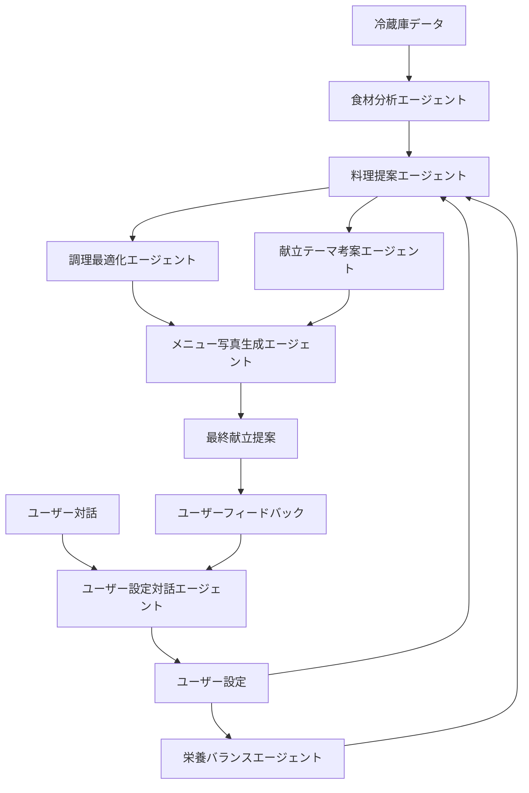

# ADKを使用したAI献立提案エージェント分担実装計画

## 概要

現在の単一AIによる献立提案を、Google ADK（Agent Development Kit）を使用して複数の専門エージェントに分担させることで、精度と専門性を向上させる実装計画です。

## 現在の課題

1. **単一AIの限界**: 現在のGemini API単体では、献立提案、栄養分析、食材最適化、レシピ生成を同時に行うため、各分野での専門性が不足
2. **精度の向上余地**: 冷蔵庫の食材分析、賞味期限考慮、栄養バランス、調理時間最適化など、複雑な判断が必要
3. **スケーラビリティ**: 将来的な機能拡張（アレルギー対応、食事制限、好み学習など）に対応しにくい

## エージェント分担設計

### 1. 食材分析エージェント (Ingredient Analysis Agent)
**責任範囲:**
- 冷蔵庫の食材データ分析
- 賞味期限の優先度付け
- 食材の鮮度・状態評価
- 利用可能食材の分類・整理

**入力:**
- 冷蔵庫の商品リスト（Product[]）
- 賞味期限データ
- 食材カテゴリ情報

**出力:**
- 優先度付き食材リスト
- 期限切れリスク食材
- 推奨使用順序

**ADK実装:**
```dart
class IngredientAnalysisAgent {
  final GenerativeModel model;
  
  Future<IngredientAnalysisResult> analyzeIngredients({
    required List<Product> products,
    required DateTime currentDate,
  }) async {
    // 食材分析専用のプロンプト
    // 賞味期限、鮮度、カテゴリを考慮した分析
  }
}
```

### 2. 栄養バランスエージェント (Nutrition Balance Agent)
**責任範囲:**
- 栄養バランスの分析・提案
- カロリー計算
- 栄養素の過不足チェック
- 食事制限・アレルギー対応

**入力:**
- 利用可能食材リスト
- ユーザーの栄養要件
- アレルギー・食事制限情報

**出力:**
- 栄養バランススコア
- 推奨栄養素
- 制限事項の警告

**ADK実装:**
```dart
class NutritionBalanceAgent {
  Future<NutritionAnalysisResult> analyzeNutrition({
    required List<Ingredient> ingredients,
    required UserNutritionProfile profile,
  }) async {
    // 栄養分析専用のプロンプト
    // カロリー、タンパク質、ビタミン、ミネラル等の分析
  }
}
```

### 3. 料理提案エージェント (Recipe Suggestion Agent)
**責任範囲:**
- 具体的な料理メニュー提案
- 調理法の選択
- 味付け・調味料の提案
- 料理の組み合わせ

**入力:**
- 分析済み食材リスト
- 栄養要件
- ユーザー設定（調理時間、難易度、好み）

**出力:**
- 主菜・副菜・汁物・主食の提案
- 調理手順
- 調味料・分量

**ADK実装:**
```dart
class RecipeSuggestionAgent {
  Future<RecipeSuggestionResult> suggestRecipes({
    required IngredientAnalysisResult ingredients,
    required NutritionAnalysisResult nutrition,
    required UserPreferences preferences,
  }) async {
    // 料理提案専用のプロンプト
    // 食材を活用した具体的な料理メニュー提案
  }
}
```

### 4. 調理最適化エージェント (Cooking Optimization Agent)
**責任範囲:**
- 調理時間の最適化
- 調理順序の提案
- 効率的な調理手順
- 同時調理の提案

**入力:**
- 提案された料理リスト
- 調理器具の制約
- 時間制約

**出力:**
- 最適化された調理手順
- 調理時間の見積もり
- 効率的な調理スケジュール

**ADK実装:**
```dart
class CookingOptimizationAgent {
  Future<CookingOptimizationResult> optimizeCooking({
    required List<Recipe> recipes,
    required CookingConstraints constraints,
  }) async {
    // 調理最適化専用のプロンプト
    // 時間効率と品質を両立した調理計画
  }
}
```

### 5. 献立テーマ考案エージェント (Meal Theme Agent)
**責任範囲:**
- 献立全体のテーマ・コンセプトの決定
- 料理の統一感の確保
- 季節感・イベント感の演出
- ユーザーの好みに基づくテーマ選択

**入力:**
- 提案された料理リスト
- ユーザーの好み・設定
- 季節・イベント情報
- 食材の特徴

**出力:**
- 献立テーマ（例：「中華風炒め物テーマ」「和風家庭料理テーマ」）
- テーマの説明・コンセプト
- 統一感のある献立の調整提案

**ADK実装:**
```dart
class MealThemeAgent {
  Future<MealThemeResult> determineTheme({
    required List<Recipe> recipes,
    required UserPreferences preferences,
    required DateTime currentDate,
  }) async {
    // 献立テーマ考案専用のプロンプト
    // 料理の統一感とコンセプトを考慮したテーマ決定
  }
}
```

### 6. メニュー写真生成エージェント (Menu Image Generation Agent)
**責任範囲:**
- 各料理の魅力的な写真生成
- 統一感のあるビジュアルスタイル
- 料理の特徴を活かした構図・照明
- 高品質な画像の生成

**入力:**
- 料理名・説明
- 食材情報
- テーマ・スタイル指定
- 画像品質要件

**出力:**
- 各料理の高品質画像URL
- 画像メタデータ（解像度、ファイル形式等）
- 生成失敗時の代替画像提案

**ADK実装:**
```dart
class MenuImageGenerationAgent {
  Future<ImageGenerationResult> generateMenuImages({
    required List<Recipe> recipes,
    required MealTheme theme,
    required ImageStyle style,
  }) async {
    // 画像生成専用のプロンプト
    // DALL-E 3やMidjourney等の画像生成AIとの連携
  }
}
```

### 7. ユーザー設定対話エージェント (User Preference Conversation Agent)
**責任範囲:**
- ユーザーとの自然な対話による設定収集
- 好み・制約事項の段階的な聞き取り
- 設定の妥当性チェック・提案
- ユーザー体験の最適化

**入力:**
- ユーザーの自然言語での回答
- 既存の設定データ
- 冷蔵庫の食材情報
- 過去の献立履歴

**出力:**
- 構造化されたユーザー設定
- 設定の信頼度スコア
- 追加質問の提案
- 設定変更の推奨

**ADK実装:**
```dart
class UserPreferenceConversationAgent {
  Future<UserPreferenceResult> collectPreferences({
    required String userInput,
    required UserProfile? existingProfile,
    required List<Product> availableIngredients,
  }) async {
    // 対話型設定収集専用のプロンプト
    // 自然言語理解と構造化データ変換
  }
  
  Future<ConversationFlow> generateNextQuestion({
    required UserPreferenceResult currentPreferences,
    required List<String> missingFields,
  }) async {
    // 次の質問を生成するロジック
    // ユーザーの回答に基づく動的な質問選択
  }
}
```

## ADK統合アーキテクチャ

### エージェント協調フロー


### 実装構造
```
lib/
├── core/
│   ├── agents/
│   │   ├── ingredient_analysis_agent.dart
│   │   ├── nutrition_balance_agent.dart
│   │   ├── recipe_suggestion_agent.dart
│   │   ├── cooking_optimization_agent.dart
│   │   ├── meal_theme_agent.dart
│   │   ├── menu_image_generation_agent.dart
│   │   └── user_preference_conversation_agent.dart
│   ├── adk/
│   │   ├── adk_client.dart
│   │   ├── agent_coordinator.dart
│   │   └── agent_communication.dart
│   └── services/
│       └── multi_agent_meal_planning_service.dart
├── features/
│   └── user_preferences/
│       ├── presentation/
│       │   ├── pages/
│       │   │   └── preference_conversation_screen.dart
│       │   └── widgets/
│       │       └── conversation_bubble.dart
│       └── domain/
│           └── models/
│               ├── user_preference.dart
│               └── conversation_flow.dart
```

## 実装ステップ

### Phase 1: ADK基盤構築
1. **ADKクライアント実装**
   - Google ADK SDK統合
   - エージェント間通信基盤
   - エラーハンドリング・リトライ機能

2. **エージェント基盤クラス**
   - 共通インターフェース定義
   - プロンプトテンプレート管理
   - レスポンス解析・バリデーション

### Phase 2: 個別エージェント実装
1. **食材分析エージェント**
   - 賞味期限分析ロジック
   - 食材カテゴリ分類
   - 優先度付けアルゴリズム

2. **栄養バランスエージェント**
   - 栄養素データベース統合
   - カロリー計算エンジン
   - バランス評価アルゴリズム

3. **ユーザー設定対話エージェント**
   - 自然言語理解エンジン
   - 対話フロー管理
   - 設定データ構造化

### Phase 3: エージェント協調実装
1. **料理提案エージェント**
   - 他エージェントの結果を統合
   - 料理メニュー生成ロジック
   - 味付け・調味料提案

2. **調理最適化エージェント**
   - 調理時間計算
   - 並行調理の最適化
   - 調理手順の効率化

3. **献立テーマ考案エージェント**
   - 料理の統一感分析
   - テーマ・コンセプト決定
   - 季節感・イベント感の演出

4. **メニュー写真生成エージェント**
   - 画像生成AIとの連携
   - 統一感のあるビジュアルスタイル
   - 高品質画像の生成・最適化

### Phase 4: 統合・テスト
1. **マルチエージェントサービス**
   - エージェント間の協調制御
   - 結果の統合・調整
   - エラーハンドリング

2. **UI統合**
   - 既存UIとの統合
   - ローディング状態の管理
   - エラー表示の改善

## 技術仕様

### ADK設定
```yaml
# pubspec.yaml
dependencies:
  google_generative_ai: ^0.2.2
  # ADK関連パッケージ（正式リリース時に追加）
  # google_adk: ^1.0.0
```

### 環境変数
```env
# .env
GEMINI_API_KEY=your_gemini_api_key
# ADK関連設定（正式リリース時に追加）
# ADK_PROJECT_ID=your_project_id
# ADK_AGENT_ENDPOINT=your_agent_endpoint
```

### エージェント設定
```dart
class AgentConfig {
  static const Map<String, AgentSettings> agents = {
    'ingredient_analysis': AgentSettings(
      model: 'gemini-1.5-pro',
      temperature: 0.3,
      maxTokens: 2000,
    ),
    'nutrition_balance': AgentSettings(
      model: 'gemini-1.5-pro',
      temperature: 0.2,
      maxTokens: 1500,
    ),
    'recipe_suggestion': AgentSettings(
      model: 'gemini-1.5-pro',
      temperature: 0.7,
      maxTokens: 3000,
    ),
    'cooking_optimization': AgentSettings(
      model: 'gemini-1.5-pro',
      temperature: 0.4,
      maxTokens: 2000,
    ),
    'meal_theme': AgentSettings(
      model: 'gemini-1.5-pro',
      temperature: 0.8,
      maxTokens: 1000,
    ),
    'menu_image_generation': AgentSettings(
      model: 'imagen-3', // Google Imagen画像生成モデル
      temperature: 0.9,
      maxTokens: 500,
    ),
    'user_preference_conversation': AgentSettings(
      model: 'gemini-1.5-pro',
      temperature: 0.6,
      maxTokens: 2000,
    ),
  };
}
```

## 期待される効果

### 精度向上
- **食材分析**: 賞味期限を考慮した最適な食材選択
- **栄養バランス**: より正確な栄養素計算とバランス評価
- **料理提案**: 食材の特性を活かした具体的な料理メニュー
- **調理最適化**: 実用的な調理時間と手順の提案
- **献立テーマ**: 統一感のある魅力的な献立コンセプト
- **画像生成**: 高品質で魅力的な料理写真
- **ユーザー設定**: 自然な対話による正確な好み・制約の把握

### 拡張性向上
- **新機能追加**: 各エージェントを独立して拡張可能
- **A/Bテスト**: 個別エージェントの性能比較・改善
- **カスタマイズ**: ユーザーごとのエージェント設定調整

### 保守性向上
- **責任分離**: 各エージェントの責任範囲が明確
- **デバッグ**: 問題の特定と修正が容易
- **テスト**: 個別エージェントの単体テストが可能

## リスクと対策

### 技術的リスク
- **ADKの成熟度**: 正式リリース前のAPI変更リスク
  - 対策: 抽象化レイヤーでAPI変更に対応
- **レスポンス時間**: 複数エージェントの並列処理による遅延
  - 対策: 非同期処理とキャッシュ機能の実装

### 運用リスク
- **コスト増加**: 複数エージェントによるAPI呼び出し増加
  - 対策: キャッシュ機能と効率的なプロンプト設計
- **複雑性**: システム全体の複雑化
  - 対策: 適切なドキュメントとテストカバレッジ

## 次のステップ

1. **ADKの正式リリース待ち**: Google ADKの正式リリースを待つ
2. **プロトタイプ開発**: 単一エージェントでの概念実証
3. **段階的移行**: 既存システムから段階的に移行
4. **性能評価**: エージェント分担による精度向上の測定

## 対話形式ユーザー設定の具体例

### 初期設定対話フロー
```
AI: こんにちは！献立提案を始める前に、いくつか質問させてください。

AI: まず、調理時間の制限はありますか？
ユーザー: 平日は30分以内で済ませたいです

AI: なるほど、平日は30分以内ですね。料理の難易度はいかがですか？
ユーザー: 簡単なものがいいです。料理はあまり得意じゃないので

AI: わかりました。アレルギーや苦手な食材はありますか？
ユーザー: エビアレルギーがあります。あと、にんじんは苦手です

AI: エビアレルギーとにんじんが苦手ですね。記録しました。
AI: 最後に、好みの料理ジャンルはありますか？
ユーザー: 和食とイタリアンが好きです

AI: ありがとうございます！設定を保存しました。
```

### 継続的学習対話
```
AI: 今日の献立はいかがでしたか？
ユーザー: 玉ねぎの炒め物が少し辛すぎました

AI: 辛さを控えめにしますね。他に気になる点はありますか？
ユーザー: もう少し野菜を多くしてほしいです

AI: 承知しました。野菜を多めに、辛さ控えめで調整します。
```

## まとめ

ADKを使用したエージェント分担により、献立提案の精度と専門性を大幅に向上させることができます。各エージェントが専門分野に特化することで、より実用的で正確な献立提案が可能になります。特に、対話形式のユーザー設定により、ユーザーの真のニーズを自然に把握し、継続的に改善できるシステムを構築できます。段階的な実装により、リスクを最小化しながら効果的なシステムを構築できます。
