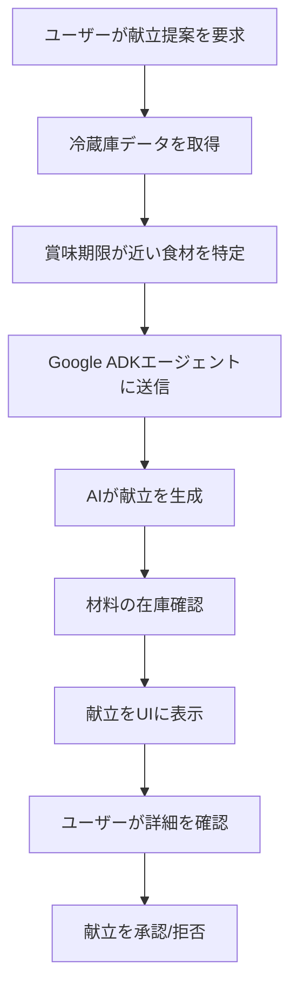
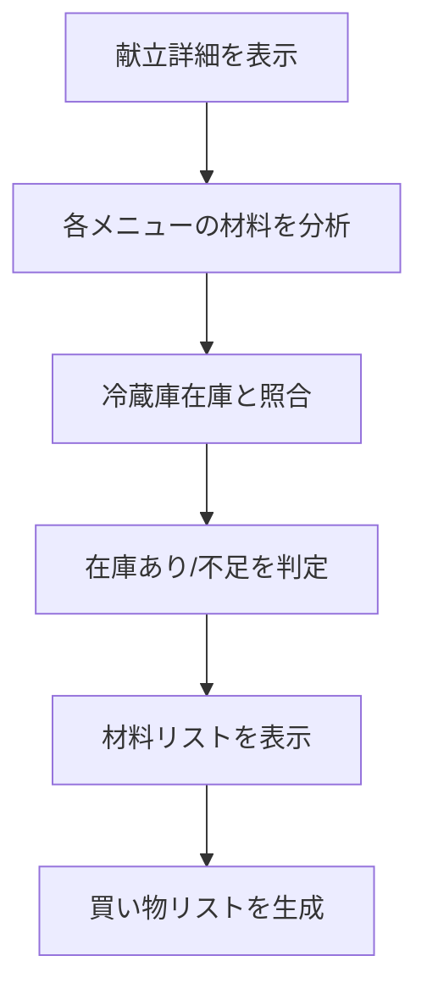

# AI献立提案機能 要件定義書

## 📋 機能概要

冷蔵庫の商品情報を基に、Google ADK（Agent Development Kit）を活用してAIが本日の献立を提案する機能を実装します。賞味期限の近い食材を優先的に使用し、主菜・副菜・汁物・主食で構成されたバランスの良い献立を提案します。

## 🎯 機能要件

### 1. 献立提案機能
- **入力**: 現在の冷蔵庫内の商品情報（商品名、カテゴリ、賞味期限、数量）
- **出力**: 本日の献立（主菜・副菜・汁物・主食）
- **AI判断基準**:
  - 賞味期限が近い食材を優先的に使用
  - 栄養バランスを考慮
  - 季節性・時節を考慮
  - 調理時間・難易度を考慮

### 2. 献立詳細表示機能
- **メニュー詳細ダイアログ**: 各メニューをタップすると詳細情報を表示
- **材料表示**:
  - 冷蔵庫にある材料（既存）
  - 買い物が必要な材料（不足）
- **レシピ表示**: 簡潔な調理手順・コツ

### 3. 材料管理機能
- **在庫確認**: 提案された献立に必要な材料の在庫状況を表示
- **買い物リスト生成**: 不足材料の自動リスト化
- **使用予定食材のマーキング**: 献立で使用予定の食材を視覚的に表示

## 🔧 技術要件

### 1. AI・機械学習
- **Google ADK (Agent Development Kit)**: 献立提案エージェントの構築
- **Vertex AI**: Gemini APIを活用した自然言語処理
- **Function Calling**: 冷蔵庫データとの連携
- **Prompt Engineering**: 献立提案の精度向上

### 2. データベース設計
```yaml
collections:
  meal_plans:
    - { planId }:
        householdId: "householdId"
        date: "2024-09-20T00:00:00Z"
        status: "suggested" # suggested, accepted, cooking, completed
        mainDish:
          name: "トマトとチキンのパスタ"
          category: "主菜"
          ingredients:
            - name: "トマト"
              available: true
              quantity: "2個"
              expiryDate: "2024-09-22T00:00:00Z"
            - name: "チキン"
              available: false
              quantity: "200g"
              shoppingRequired: true
          recipe:
            steps: ["チキンを炒める", "トマトを加える", "パスタと和える"]
            cookingTime: "20分"
            difficulty: "簡単"
        sideDish:
          name: "サラダ"
          category: "副菜"
          # ... 同様の構造
        soup:
          name: "味噌汁"
          category: "汁物"
          # ... 同様の構造
        rice:
          name: "白米"
          category: "主食"
          # ... 同様の構造
        createdAt: "2024-09-20T00:00:00Z"
        createdBy: "userId"
```

### 3. API設計
```yaml
endpoints:
  POST /api/meal-plans/suggest:
    description: 献立提案を生成
    request:
      body:
        householdId: string
        preferences:
          cookingTime: "short" | "medium" | "long"
          difficulty: "easy" | "medium" | "hard"
          dietaryRestrictions: string[]
    response:
      mealPlan: MealPlan
      confidence: number
      alternatives: MealPlan[]

  GET /api/meal-plans/{planId}:
    description: 献立詳細を取得
    response:
      mealPlan: MealPlan
      ingredients: Ingredient[]
      shoppingList: ShoppingItem[]

  POST /api/meal-plans/{planId}/accept:
    description: 献立を承認
    response:
      success: boolean
      shoppingList: ShoppingItem[]
```

## 🎨 UI/UX要件

### 1. 献立提案画面
- **レイアウト**: カード形式で主菜・副菜・汁物・主食を表示
- **視覚的要素**:
  - 各メニューの画像
  - 調理時間・難易度のアイコン
  - 賞味期限が近い食材のハイライト
- **インタラクション**:
  - タップで詳細ダイアログ表示
  - スワイプで代替案表示
  - 長押しでお気に入り登録

### 2. 献立詳細ダイアログ
- **材料セクション**:
  - 冷蔵庫にある材料（緑色のチェックマーク）
  - 買い物が必要な材料（赤色の警告マーク）
  - 数量・賞味期限の表示
- **レシピセクション**:
  - ステップバイステップの調理手順
  - 調理時間・難易度
  - コツ・ポイント

### 3. 買い物リスト画面
- **自動生成**: 献立で不足している材料を自動リスト化
- **カテゴリ別表示**: 野菜・肉・調味料などでグループ化
- **チェック機能**: 購入済みの管理

## 🔄 処理フロー

### 1. 献立提案フロー


### 2. 材料確認フロー


## 📊 成功指標

### 1. 機能面
- **献立提案精度**: ユーザー満足度80%以上
- **材料活用率**: 冷蔵庫食材の70%以上を活用
- **賞味期限管理**: 期限切れ食材の90%以上を事前活用

### 2. パフォーマンス
- **応答時間**: 献立提案3秒以内
- **API可用性**: 99.9%以上
- **データ同期**: リアルタイム更新

### 3. ユーザビリティ
- **直感的操作**: 3タップ以内で献立詳細表示
- **視覚的わかりやすさ**: 材料の在庫状況が一目で分かる
- **アクセシビリティ**: 音声読み上げ対応

## 🚀 実装優先度

### Phase 1 (MVP)
1. 基本的な献立提案機能
2. 材料の在庫確認機能
3. シンプルなレシピ表示

### Phase 2 (機能拡張)
1. 買い物リスト自動生成
2. 献立の保存・履歴機能
3. ユーザー好みの学習機能

### Phase 3 (高度な機能)
1. 栄養バランス分析
2. アレルギー対応
3. 家族の好みに基づく提案

## 🔒 セキュリティ・プライバシー

### 1. データ保護
- 個人の食事データの暗号化
- 家族間でのデータ共有制御
- データの自動削除機能

### 2. AI倫理
- 偏見のない献立提案
- 文化的多様性の尊重
- 透明性のあるAI判断プロセス

## 📱 対応プラットフォーム

- **iOS**: ネイティブ対応
- **Android**: ネイティブ対応  
- **Web**: レスポンシブ対応
- **アクセシビリティ**: スクリーンリーダー対応

