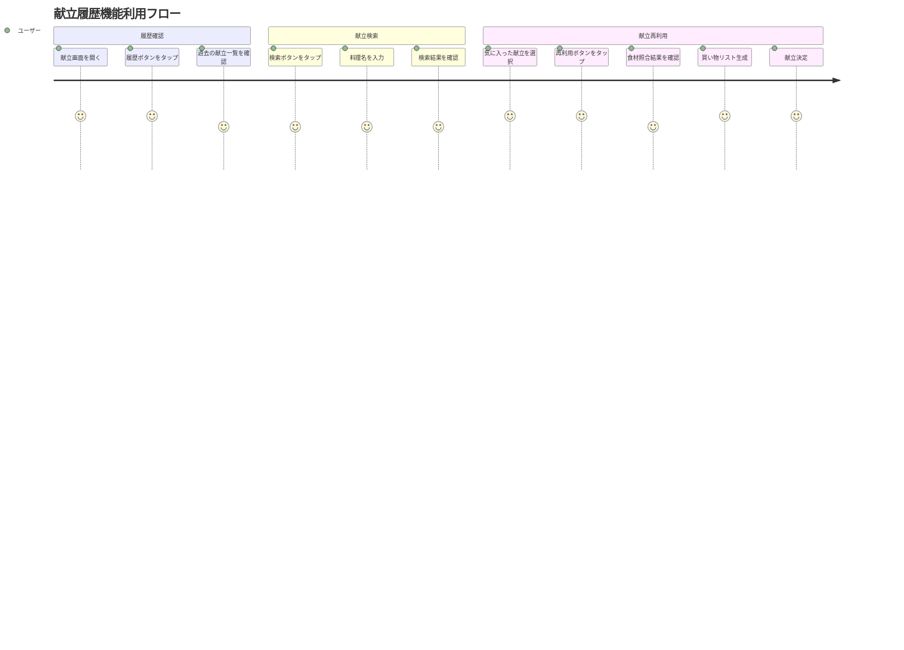

# 献立履歴機能 - 詳細要件定義書

## 📋 プロジェクト基本情報

| 項目 | 内容 |
|------|------|
| プロジェクト名 | 献立履歴機能実装 |
| 対象システム | GCP-Hackathon-F06 冷蔵庫管理アプリ |
| 実装対象 | 献立提案画面の履歴機能 |
| 予定期間 | 5-7日間 |
| 優先度 | 高 |
| 複雑度 | 中程度 (⭐⭐⭐☆☆) |

## 🎯 ビジネス要件

### 背景・課題
- 現在、献立提案機能はあるが過去の献立を確認する手段がない
- ユーザーが気に入った献立を再度作りたい場合に不便
- 献立の履歴管理により、食事のバリエーション管理が可能になる
- 過去の成功体験を活用した効率的な献立計画が必要

### ビジネス目標
1. **ユーザーエンゲージメント向上** - 過去献立の再利用により利用頻度向上
2. **利便性向上** - 献立選択の効率化
3. **食品ロス削減** - 成功した献立パターンの再利用
4. **ユーザー満足度向上** - より使いやすい献立管理システム

### 成功指標
- 履歴機能の利用率: 50%以上
- 過去献立再利用率: 30%以上
- 献立決定までの時間短縮: 20%以上
- ユーザー満足度: 4.0/5.0以上

## 👥 ユーザー要件

### ターゲットユーザー
1. **メインユーザー**: 家庭で献立を管理する人（主に主婦・主夫）
2. **サブユーザー**: 一人暮らしで自炊をする人
3. **ファミリーユーザー**: 家族の献立を管理する人

### ユーザーストーリー
```gherkin
As a 献立管理者
I want to 過去の献立履歴を確認できる
So that 気に入った献立を再度作ることができる

As a 忙しい料理担当者  
I want to 過去の献立を簡単に再利用できる
So that 献立を考える時間を短縮できる

As a 食材管理者
I want to 過去の献立で使った食材を確認できる
So that 効率的な買い物計画を立てられる
```

### ユーザージャーニー


## 🔧 機能要件

### 1. 献立履歴表示機能

#### 1.1 基本表示機能
- **要件ID**: REQ-001
- **優先度**: 高
- **説明**: 過去の献立を時系列で一覧表示する

**詳細仕様**:
```yaml
display_format:
  layout: "縦スクロールリスト"
  item_height: "120px"
  items_per_page: "20件"
  loading_strategy: "無限スクロール"

display_items:
  - meal_image: "料理画像（サムネイル）"
  - meal_name: "主菜名"
  - creation_date: "作成日時（相対表示）"
  - status: "献立状態（アイコン付き）"
  - cooking_time: "調理時間"
  - difficulty: "難易度"
  - nutrition_score: "栄養スコア"
  - reuse_button: "再利用ボタン"

sort_order: "作成日時降順（新しい順）"
```

**受け入れ基準**:
- [ ] 過去の献立が時系列で表示される
- [ ] 各献立の基本情報が適切に表示される
- [ ] 20件ずつページングで表示される
- [ ] スクロール時の追加読み込みが機能する
- [ ] ローディング状態が適切に表示される

#### 1.2 献立詳細表示機能
- **要件ID**: REQ-002
- **優先度**: 中
- **説明**: 選択した献立の詳細情報を表示する

**詳細仕様**:
```yaml
display_method: "ボトムシートまたはダイアログ"
content:
  basic_info:
    - meal_name: "献立名"
    - creation_date: "作成日時"
    - status: "状態"
    - total_cooking_time: "総調理時間"
    - difficulty: "難易度"
    - nutrition_score: "栄養スコア"
  
  meal_items:
    - main_dish: "主菜（名前、説明、材料、レシピ）"
    - side_dish: "副菜（名前、説明、材料、レシピ）"
    - soup: "汁物（名前、説明、材料、レシピ）"
    - rice: "主食（名前、説明、材料、レシピ）"
  
  additional_info:
    - shopping_list: "買い物リスト（あれば）"
    - nutrition_info: "栄養情報"
```

**受け入れ基準**:
- [ ] 献立アイテムタップで詳細が表示される
- [ ] 4品すべての詳細情報が表示される
- [ ] 材料リストが適切に表示される
- [ ] レシピ手順が分かりやすく表示される
- [ ] 閉じるボタンで元の画面に戻る

### 2. フィルタリング機能

#### 2.1 状態フィルター
- **要件ID**: REQ-003
- **優先度**: 中
- **説明**: 献立の状態（提案中、承認済み、完了、キャンセル）で絞り込む

**詳細仕様**:
```yaml
filter_options:
  - all: "すべて（デフォルト）"
  - suggested: "提案中"
  - accepted: "承認済み"
  - completed: "完了"
  - cancelled: "キャンセル"

ui_component: "FilterChip（水平スクロール）"
behavior: "単一選択"
persistence: "セッション中保持"
```

**受け入れ基準**:
- [ ] 状態別フィルターが機能する
- [ ] フィルター選択時にリストが更新される
- [ ] 選択状態が視覚的に分かる
- [ ] 「すべて」選択でフィルターがリセットされる

#### 2.2 期間フィルター
- **要件ID**: REQ-004
- **優先度**: 中
- **説明**: 作成日時の期間で絞り込む

**詳細仕様**:
```yaml
filter_options:
  - last_week: "過去1週間"
  - last_month: "過去1ヶ月"
  - last_3_months: "過去3ヶ月"
  - custom: "カスタム期間（日付選択）"

ui_component: "DropdownButton または DateRangePicker"
default_value: "すべて（制限なし）"
```

**受け入れ基準**:
- [ ] 期間指定でフィルタリングできる
- [ ] カスタム期間選択が機能する
- [ ] 期間外の献立が非表示になる
- [ ] フィルター解除が可能

#### 2.3 難易度フィルター
- **要件ID**: REQ-005
- **優先度**: 低
- **説明**: 献立の難易度で絞り込む

**詳細仕様**:
```yaml
filter_options:
  - easy: "簡単"
  - medium: "普通"
  - hard: "難しい"
  - expert: "上級"

ui_component: "FilterChip（複数選択可能）"
behavior: "複数選択"
```

### 3. 検索機能

#### 3.1 テキスト検索
- **要件ID**: REQ-006
- **優先度**: 中
- **説明**: 料理名や材料名で献立を検索する

**詳細仕様**:
```yaml
search_targets:
  - main_dish_name: "主菜名"
  - side_dish_name: "副菜名"
  - soup_name: "汁物名"
  - rice_name: "主食名"
  - ingredients: "材料名"

search_behavior:
  - type: "部分一致検索"
  - case_sensitive: false
  - real_time: true
  - min_characters: 1

ui_component: "SearchBar（AppBar内）"
placeholder: "献立を検索..."
```

**受け入れ基準**:
- [ ] 料理名での検索が機能する
- [ ] 材料名での検索が機能する
- [ ] リアルタイム検索が機能する
- [ ] 検索結果のハイライト表示
- [ ] 検索クリア機能

### 4. 過去献立再利用機能

#### 4.1 献立選択・再利用
- **要件ID**: REQ-007
- **優先度**: 高
- **説明**: 過去の献立を選択して現在の献立として再設定する

**詳細仕様**:
```yaml
trigger: "献立アイテムの再利用ボタンタップ"
process:
  1. ingredient_analysis: "現在の冷蔵庫食材との照合"
  2. missing_check: "不足材料の特定"
  3. confirmation_dialog: "再利用確認ダイアログ表示"
  4. shopping_list_generation: "買い物リスト生成（必要時）"
  5. meal_plan_setting: "現在の献立として設定"

confirmation_dialog_content:
  - selected_meal: "選択された献立名"
  - available_ingredients: "利用可能な材料リスト"
  - missing_ingredients: "不足している材料リスト"
  - estimated_cost: "概算費用（可能であれば）"
```

**受け入れ基準**:
- [ ] 再利用ボタンで確認ダイアログが表示される
- [ ] 現在の冷蔵庫食材との照合が正確
- [ ] 不足材料が適切に表示される
- [ ] 買い物リスト生成が連携する
- [ ] 献立が現在の献立として設定される

#### 4.2 食材照合機能
- **要件ID**: REQ-008
- **優先度**: 高
- **説明**: 過去献立の材料と現在の冷蔵庫食材を照合する

**詳細仕様**:
```yaml
matching_logic:
  - exact_match: "完全一致"
  - partial_match: "部分一致（含む・含まれる）"
  - category_match: "カテゴリ一致（代替可能）"

matching_algorithm:
  1. name_comparison: "商品名と材料名の比較"
  2. expiry_check: "賞味期限の確認"
  3. quantity_check: "必要量と在庫量の比較"
  4. availability_status: "利用可能性の判定"

result_categories:
  - available: "利用可能（十分な量）"
  - insufficient: "不足（量が足りない）"
  - expired: "期限切れ"
  - missing: "在庫なし"
```

**受け入れ基準**:
- [ ] 食材名の照合が正確に動作する
- [ ] 賞味期限の考慮が適切
- [ ] 必要量と在庫量の比較が正確
- [ ] 照合結果の分類が適切

### 5. UI/UX機能

#### 5.1 デザイン統一
- **要件ID**: REQ-009
- **優先度**: 高
- **説明**: 既存画面とのデザイン統一性を保つ

**詳細仕様**:
```yaml
color_scheme:
  - base_color: "Color(0xFFF6EACB) - クリーム色"
  - primary_color: "Color(0xFFD4A574) - 温かいベージュ"
  - secondary_color: "Color(0xFFB8956A) - 深いベージュ"
  - accent_color: "Color(0xFF8B7355) - ブラウン"
  - text_color: "Color(0xFF5D4E37) - ダークブラウン"

typography:
  - font_family: "システムデフォルト"
  - heading_size: "18-20px"
  - body_size: "14-16px"
  - caption_size: "12px"

component_style:
  - border_radius: "12px"
  - padding: "16px"
  - margin: "8-16px"
  - elevation: "2-4dp"
```

#### 5.2 レスポンシブデザイン
- **要件ID**: REQ-010
- **優先度**: 中
- **説明**: 様々な画面サイズに対応する

**詳細仕様**:
```yaml
breakpoints:
  - small: "< 600px（スマートフォン）"
  - medium: "600-1024px（タブレット）"
  - large: "> 1024px（デスクトップ）"

responsive_behavior:
  - layout_adaptation: "画面サイズに応じたレイアウト調整"
  - text_scaling: "テキストサイズの適応"
  - touch_target: "タッチターゲットサイズの確保"
```

## 🔒 非機能要件

### 1. パフォーマンス要件

#### 1.1 応答時間
- **初期表示時間**: 2秒以内
- **検索レスポンス時間**: 1秒以内
- **フィルタリング時間**: 500ms以内
- **詳細表示時間**: 500ms以内

#### 1.2 スループット
- **同時ユーザー数**: 100人
- **データ取得量**: 1回あたり20件
- **無限スクロール**: 80%スクロール時に追加読み込み

#### 1.3 リソース使用量
- **メモリ使用量増加**: 50MB以下
- **ストレージ使用量**: キャッシュ10MB以下
- **ネットワーク使用量**: 1回の読み込み1MB以下

### 2. 可用性要件
- **稼働率**: 99.9%以上
- **障害復旧時間**: 5分以内
- **データ整合性**: 100%

### 3. セキュリティ要件
- **認証**: Firebase Authentication連携
- **認可**: ユーザー別データアクセス制御
- **データ暗号化**: Firebase標準暗号化
- **プライバシー**: 個人データの適切な保護

### 4. 使いやすさ要件
- **学習時間**: 初回利用時5分以内
- **操作効率**: 目的の献立検索3タップ以内
- **エラー回復**: 明確なエラーメッセージと回復手順
- **アクセシビリティ**: スクリーンリーダー対応

### 5. 保守性要件
- **コード品質**: Dart Analyzer準拠
- **テストカバレッジ**: 80%以上
- **ドキュメント**: 全機能の仕様書完備
- **モジュール性**: 機能別ファイル分割

## 🧪 テスト要件

### 1. 単体テスト
```yaml
test_targets:
  - MealPlanHistoryScreen: "画面コンポーネント"
  - MealHistoryItemCard: "履歴アイテムカード"
  - MealReuseConfirmationDialog: "再利用確認ダイアログ"
  - filtering_logic: "フィルタリングロジック"
  - search_logic: "検索ロジック"
  - ingredient_matching: "食材照合ロジック"

coverage_target: "80%以上"
```

### 2. 統合テスト
```yaml
test_scenarios:
  - meal_history_display_flow: "履歴表示フロー"
  - filtering_and_search_flow: "フィルタリング・検索フロー"
  - meal_reuse_flow: "献立再利用フロー"
  - error_handling_flow: "エラーハンドリングフロー"
```

### 3. ユーザビリティテスト
```yaml
test_users: "5名の実際のユーザー"
test_tasks:
  - "過去の献立を探して再利用する"
  - "特定の料理名で検索する"
  - "完了済みの献立のみを表示する"
  - "不足材料を確認して買い物リストを作成する"

success_criteria:
  - task_completion_rate: "90%以上"
  - user_satisfaction: "4.0/5.0以上"
  - task_completion_time: "目標時間以内"
```

### 4. パフォーマンステスト
```yaml
load_testing:
  - concurrent_users: "100人"
  - test_duration: "30分"
  - success_criteria: "レスポンス時間要件を満たす"

stress_testing:
  - data_volume: "1000件の献立履歴"
  - memory_usage: "50MB以下の増加"
  - scroll_performance: "60fps維持"
```

## 📊 データ要件

### 1. データモデル
```yaml
existing_model: "MealPlan（既存）"
required_fields:
  - id: "String?"
  - householdId: "String"
  - date: "DateTime"
  - status: "MealPlanStatus"
  - mainDish: "MealItem"
  - sideDish: "MealItem"
  - soup: "MealItem"
  - rice: "MealItem"
  - createdAt: "DateTime"
  - acceptedAt: "DateTime?"
  - completedAt: "DateTime?"

additional_fields: "不要（既存フィールドで十分）"
```

### 2. データベース要件
```yaml
firestore_collection: "meal_plans"
required_indexes:
  - composite_index_1:
      fields: ["householdId", "createdAt"]
      order: ["ASC", "DESC"]
  - composite_index_2:
      fields: ["householdId", "status", "createdAt"]
      order: ["ASC", "ASC", "DESC"]

query_patterns:
  - time_series_query: "時系列取得"
  - status_filter_query: "状態別フィルタリング"
  - date_range_query: "期間指定取得"
  - search_query: "テキスト検索（クライアントサイド）"
```

### 3. データ移行
```yaml
migration_required: false
reason: "既存データ構造をそのまま利用"
compatibility: "完全な後方互換性"
```

## 🚀 リリース要件

### 1. リリース戦略
```yaml
release_type: "段階的リリース"
phases:
  - phase_1: "基本履歴表示機能"
  - phase_2: "フィルタリング・検索機能"
  - phase_3: "再利用機能"
  - phase_4: "最適化・改善"

rollback_plan: "機能フラグによる無効化"
```

### 2. デプロイメント要件
```yaml
environments:
  - development: "開発環境での動作確認"
  - staging: "ステージング環境でのテスト"
  - production: "本番環境へのデプロイ"

deployment_method: "Firebase Hosting（Web）/ App Store・Google Play（Mobile）"
```

### 3. モニタリング要件
```yaml
metrics:
  - feature_usage: "機能利用率"
  - performance_metrics: "パフォーマンス指標"
  - error_rates: "エラー発生率"
  - user_feedback: "ユーザーフィードバック"

monitoring_tools:
  - firebase_analytics: "利用状況分析"
  - crashlytics: "クラッシュ監視"
  - performance_monitoring: "パフォーマンス監視"
```

## 📋 制約条件

### 1. 技術制約
- **フレームワーク**: Flutter（既存）
- **状態管理**: Riverpod（既存）
- **データベース**: Cloud Firestore（既存）
- **認証**: Firebase Authentication（既存）

### 2. リソース制約
- **開発期間**: 最大7日間
- **開発者数**: 1名（AI Assistant）
- **予算**: 追加コストなし（既存インフラ利用）

### 3. ビジネス制約
- **既存機能への影響**: 最小限に抑制
- **ユーザー体験**: 既存UIとの統一性保持
- **データ互換性**: 既存データとの完全互換

### 4. 法的制約
- **プライバシー**: 個人情報保護法準拠
- **データ保護**: GDPR準拠（該当する場合）
- **利用規約**: 既存の利用規約の範囲内

## 🔄 変更管理

### 1. 要件変更プロセス
```yaml
change_request_process:
  1. change_identification: "変更要求の特定"
  2. impact_analysis: "影響度分析"
  3. approval_process: "承認プロセス"
  4. implementation: "実装"
  5. testing: "テスト"
  6. documentation_update: "ドキュメント更新"
```

### 2. バージョン管理
```yaml
versioning_scheme: "セマンティックバージョニング"
version_control: "Git"
branch_strategy: "GitFlow"
```

## 📞 コミュニケーション

### 1. ステークホルダー
- **プロダクトオーナー**: ユーザー（要件提供者）
- **開発者**: Claude AI Assistant
- **テスター**: 開発者（自己テスト）
- **エンドユーザー**: アプリ利用者

### 2. 報告体制
```yaml
progress_reporting:
  - frequency: "日次"
  - format: "進捗レポート"
  - content: "完了タスク、課題、次の予定"

issue_reporting:
  - severity_classification: "高・中・低"
  - escalation_path: "即座に報告"
  - resolution_tracking: "課題管理システム"
```

---

**文書作成者**: Claude AI Assistant  
**作成日**: 2025-01-19  
**文書バージョン**: 1.0  
**承認者**: ユーザー  
**次回レビュー日**: 実装完了後
