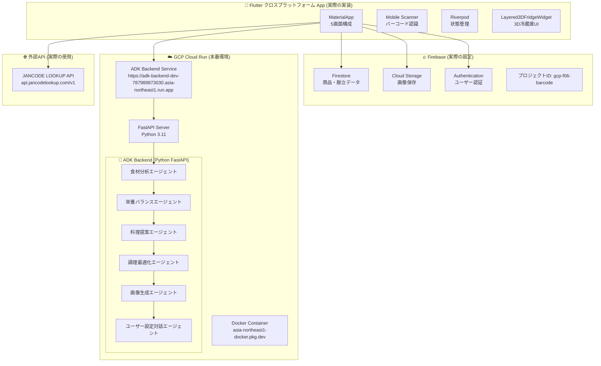

# 🍅 食品ロス削減を目指すAI冷蔵庫管理アプリ - Edibuddy


## 🎬 デモ動画

*（実際の動作デモビデオをここに挿入予定）*

## 1. 背景・課題

### 🛒 買い物時の困った経験

「あれ、冷蔵庫に何があったっけ？」買い物中によくあるこの疑問。冷蔵庫を開けて確認したつもりでも、実際にスーパーに来ると記憶が曖昧になってしまいます。

**よくあるシチュエーション:**
- 冷蔵庫に牛乳があるかどうか分からず、念のため買って帰ったら既に2本あった
- 野菜室の奥に隠れていたキャベツを忘れていて、新しいキャベツを買ってしまった
- 期限切れの食材を発見して、結局捨てることになってしまった

### 📊 個人のトラブルが社会問題に

このような「ちょっとした困った経験」が積み重なると、深刻な社会問題につながります：

**日本における食品ロスの現状:**
- 年間約570万トンの食品が廃棄（国民一人当たり年間約45kg）[^1]
- 家庭での食品ロスが全体の約半分を占める[^2]
- 1世帯当たり年間約6万円相当の食材を廃棄[^3]

**根本的な原因:**
- **冷蔵庫の中身の把握不足**: 何があるか分からないから重複購入
- **賞味期限の管理困難**: 期限切れに気づかず廃棄
- **レシピの思い浮かばなさ**: 期限が近い食材の使い道が分からない
- **家族間の情報共有不足**: 誰が何を買ったか分からない

### 💡 解決へのアプローチ

これらの課題を解決するため、私たちは**AI技術とゲーミフィケーション**を活用した革新的な冷蔵庫管理アプリを開発しました。単なる管理ツールではなく、食材との「感情的なつながり」を創出することで、自然な形で食品ロス削減行動を促進します。

## 2. Edibuddyとは

Edibuddyは、食材をキャラクター化し、賞味期限管理を楽しい体験に変える革新的なモバイルアプリケーションです。バーコードスキャンで商品情報を自動取得し、AIが賞味期限に応じて食材の感情を表現します。

### 🎯 プロジェクトのビジョン

**「食材との感情的なつながりを通じて、楽しく食品ロスを削減する」**

従来の機能的なアプローチとは異なり、私たちは食材を「生きているキャラクター」として表現することで、ユーザーが食材に対して感情的な愛着を持てるようにしました。これにより、食材を無駄にすることへの心理的な抵抗感を生み出し、自然な形で食品ロス削減行動を促進します。

### 🌟 独自性とイノベーション

このアプリの最大の特徴は、**AIによるキャラクター生成**と**感情表現システム**、そして**智能的な献立提案**です：

- **動的キャラクター生成**: Nano Bananaを使用して、各食材に固有のキャラクターを自動生成
- **感情表現の進化**: 賞味期限に応じてキャラクターの表情や見た目が変化
- **ストーリー性のある体験**: 単なる管理ツールではなく、食材との「物語」を創出
- **AI献立提案システム**: 冷蔵庫の中身からADKエージェントが最適な献立を提案し、計画的な買い物と食品ロス削減を実現

## 3. 機能

### 3.1 iOSアプリの実際の機能構成

**Edibuddy**は、Flutterで開発されたiOSアプリケーションで、以下の5つのメイン画面で構成されています：

#### 📱 実際の画面構成

**1. ホーム画面 (HomeScreen)**
- Layered3DFridgeWidgetによる多層構造の冷蔵庫表示
- 扉の開閉アニメーション（大扉・左右分割・引き出し）
- 各セクション（冷蔵室・野菜室・冷凍室）へのタップアクセス
- 食材の配置と視覚的な管理

**2. 献立画面 (MealPlanScreen)**
- ADK APIクライアントによる献立提案
- 6つの専門エージェント協調システム
- 代替メニューの表示切り替え機能
- 買い物リストの生成

**3. スキャン画面 (ScannerScreen)**
- Mobile Scannerによるバーコード認識
- Open Food Facts APIからの商品情報取得
- 手動入力フォーム（商品名・メーカー・カテゴリ・賞味期限）
- AI予測による賞味期限設定

**4. 履歴画面 (HistoryScreen)**
- 過去の食材登録履歴表示
- 日時順での並び替え
- プルリフレッシュ機能

**5. 設定画面 (SettingsScreen)**
- 通知設定
- カテゴリ管理
- データクリア機能

### 3.2 実際の技術実装

#### 🔧 コア技術スタック

**1. バーコードスキャン機能**
- Mobile Scanner (v7.0.1) によるiOSカメラ統合
- JANCODE LOOKUP API 
- FirestoreServiceによる商品情報キャッシュ
- 手動入力フォーム（5つのカテゴリ：飲料・食品・調味料・冷凍食品・その他）

**2. 3D冷蔵庫UI**
- Layered3DFridgeWidget（1270行のカスタムウィジェット）
- 複数のアニメーションコントローラー
- 扉の開閉状態管理
- セクション別の食材表示

**3. AI画像生成**
- Nano Banana API（Nano Bananaサーバーに接続）
- ADKApiClient.forSimpleImageApi()を使用
- 5段階感情表現（😊新鮮・😐普通・😟心配・😰緊急・💀期限切れ）
- 並列画像生成による効率化

**4. 献立提案システム**
- ADK APIクライアント（ADKサーバーに接続）
- 5つの専門エージェント（食材分析・栄養バランス・料理提案・調理最適化・画像生成）
- 代替メニュー生成機能

### 3.3 実際のシステムアーキテクチャ

#### 実装ベースの技術構成

**「Flutter クロスプラットフォーム・Firebase・GCP Cloud Run・ADK Backend統合」モデル**



#### 実際のアーキテクチャの特徴

1. **Flutter クロスプラットフォーム App**: iOS・Android・Web対応（5画面構成：ホーム・献立・スキャン・履歴・設定）
2. **Firebase統合**: プロジェクトID `gcp-f06-barcode` でFirestore・Storage・Auth
3. **GCP Cloud Run**: ADK Backendをクラウドでホスティング（開発環境）
4. **ADK Backend**: 6エージェント協調システム（Cloud Run上で動作）
5. **JANCODE LOOKUP API**: 日本の商品データベースAPI

### 3.4 AIシステム

#### 🤖 ADK マルチエージェントシステム（献立提案専用）

**5つの専門エージェントによる献立提案**

ADKシステムは献立提案機能に特化して設計されており、冷蔵庫の食材から最適な料理メニューを提案するために5つの専門エージェントが協調して動作します。

**エージェントの役割分担**
- **食材分析エージェント**: 冷蔵庫の食材データから賞味期限の優先度を分析し、使用すべき食材の順序を決定
- **栄養バランスエージェント**: 提案する献立の栄養価を計算し、バランスの取れた食事を設計
- **料理提案エージェント**: 分析結果を基に具体的な料理メニューと調理方法を提案
- **調理最適化エージェント**: 複数の料理を効率的に作るための手順と時間配分を最適化
- **ユーザー設定対話エージェント**: 自然言語でのユーザー要求を理解し、個人の好みや制約を献立に反映

各エージェントは段階的に処理を行い、前のエージェントの結果を受けて次の分析を実行することで、単体のAIでは実現できない高精度な献立提案を実現しています。

#### 🎨 Nano Banana 画像生成システム

**食材キャラクター専用生成システム**

Nano Banana APIを使用して食材のキャラクター画像を生成します。ADKApiClient.forSimpleImageApi()を通じてNano Bananaサーバーに接続し、商品追加時に即座にキャラクター画像を生成します。

**5段階感情表現による視覚化**

食材の賞味期限に応じて5つの感情状態（新鮮・普通・心配・緊急・期限切れ）を定義し、それぞれに対応したキャラクター画像を並列生成します。賞味期限が近づくにつれて、笑顔から心配顔、そして最終的にはゾンビ風の見た目へと変化することで、ユーザーに視覚的に期限の緊急度を伝えます。

**並列画像生成による効率化**

商品が登録されると、5つの感情状態すべての画像を同時に生成し、賞味期限の変化に応じて即座に表示を切り替えることができます。これにより、日々の期限チェック時にリアルタイムな視覚フィードバックを提供できます。

#### データベース構造

**Firestore コレクション設計**

```yaml
# 世帯管理
households:
  - householdId:
      name: "〇〇家の冷蔵庫"
      members: ["userId1", "userId2"]
      settings:
        notificationEnabled: true
        expiryWarningDays: 3

# 食材アイテム
items:
  - itemId:
      productName: "トマト"
      category: "野菜"
      quantity: 3
      expiryDate: "2024-09-30T00:00:00Z"
      status: "fresh" # fresh, soon, expired
      imageUrls:
        fresh: "gs://bucket/tomato_fresh.png"
        soon: "gs://bucket/tomato_soon.png"
        expired: "gs://bucket/tomato_expired.png"

# レシピ履歴
recipes:
  - recipeId:
      name: "トマトパスタ"
      usedIngredients: ["トマト", "パスタ"]
      cookingTime: "20分"
      createdAt: "2024-09-20T00:00:00Z"
```

## 4. 使用技術

### 4.1 実際のフロントエンド技術

#### Flutter クロスプラットフォーム実装

| 技術 | バージョン | 実際の用途 |
|------|-----------|-----------|
| **Flutter** | 3.35.2 | iOS・Android・Web クロスプラットフォーム開発 |
| **Dart** | 3.5.0 | プログラミング言語 |
| **Riverpod** | 2.6.1 | 状態管理（appStateProvider等） |
| **Material Design 3** | - | MaterialApp使用 |

#### 実際のプラットフォーム機能

**iOS機能:**
- **Mobile Scanner**: v7.0.1 - iOSカメラによるバーコード認識
- **Permission Handler**: v11.3.1 - カメラ・フォトライブラリアクセス
- **Flutter Secure Storage**: v9.2.2 - iOS Keychain統合

**Android機能:**
- **Mobile Scanner**: v7.0.1 - Androidカメラによるバーコード認識
- **Permission Handler**: v11.3.1 - カメラ・ストレージアクセス
- **Flutter Secure Storage**: v9.2.2 - Android Keystore統合

**Web機能:**
- **Web Camera API**: ブラウザカメラによるバーコード認識
- **Flutter Dotenv**: v5.2.1 - 環境変数管理
- **HTTP**: v1.1.0 - API通信

**共通機能:**
- **Google Generative AI**: v0.4.0 - Gemini API統合
- **Universal Platform**: v1.1.0 - プラットフォーム検出
- **Material Icons**: v1.0.8 - クロスプラットフォームアイコン

### 4.2 バックエンド・インフラ技術

#### Firebase Suite (実際の設定)

| サービス | バージョン | 実際の用途 |
|----------|-----------|-----------|
| **Firebase Core** | v3.15.2 | 基本初期化 |
| **Firebase Auth** | v5.3.3 | ユーザー認証 |
| **Cloud Firestore** | v5.5.1 | 商品・献立データ保存 |
| **Firebase Storage** | v12.3.7 | 画像保存 |
| **プロジェクトID** | - | gcp-f06-barcode |

#### ADK Backend (Python FastAPI on Cloud Run)

**実際の実装構成**

| コンポーネント | バージョン | 実際の用途 |
|---------------|-----------|-----------|
| **FastAPI** | Python 3.11 | REST API フレームワーク |
| **Google ADK** | v0.2.0+ | マルチエージェント協調システム |
| **Uvicorn** | ASGI Server | Cloud Run上で起動 |
| **Pydantic** | v2.0+ | データバリデーション |
| **Structlog** | v23.2.0 | 構造化ログ出力 |
| **Docker** | - | コンテナ化デプロイ |
| **Cloud Run** | - | サーバーレス実行環境 |

**実際の6エージェント構成:**
1. **ingredient_analysis_agent.py** - 賞味期限・優先度分析
2. **nutrition_balance_agent.py** - 栄養素計算・バランス評価  
3. **recipe_suggestion_agent.py** - 具体的メニュー提案
4. **cooking_optimization_agent.py** - 時間・手順最適化
5. **image_generation_agent.py** - 食材キャラクター画像生成
6. **user_preference_conversation_agent.py** - 自然言語での設定収集

**Cloud Run デプロイ設定:**
- **サービスURL**: `https://adk-backend-dev-787989873030.asia-northeast1.run.app`
- **リージョン**: asia-northeast1
- **メモリ**: 1Gi
- **CPU**: 1
- **認証**: 不要（開発環境）

#### 画像生成システム (ADK Backend統合)

| サービス | 実際の設定 | 用途 |
|----------|-----------|------|
| **ADK Image Generation** | Cloud Run上で動作 | 食材キャラクター画像生成 |
| **ADKApiClient** | Cloud Run API呼び出し | 画像生成API呼び出し |
| **生成スタイル** | kawaii | 可愛いキャラクター生成 |
| **画像サイズ** | 512x512 | 統一されたサイズ |
| **API エンドポイント** | `/api/v1/image-generation/generate` | 画像生成専用エンドポイント |

### 4.3 AI・機械学習技術

#### 自然言語処理

**Gemini 1.5 Pro (ADK Backend - 献立提案専用)**
- 6つの専門エージェントによる献立提案の高精度処理
- Function Callingによる構造化データ出力
- エージェント特性に応じた最適化

**Gemini 1.5 Flash (Flutter Client)**
- 軽量レシピ提案
- 商品情報の構造化データ変換
- ユーザーとの対話型インターフェース

#### 画像生成システム (AI指示とプロンプト設計)

**ADK Backend による食材キャラクター生成**

Cloud Run上で動作するADK Backendの画像生成エージェントが、Google Gemini APIを使用して食材のキャラクター画像を生成します。AIには以下のような詳細な指示を与えています：

**基本生成指示:**
- API: `https://generativelanguage.googleapis.com/v1beta`
- モデル: `gemini-2.5-flash-image-preview`
- スタイル: kawaii（可愛い）キャラクター
- サイズ: 512x512ピクセル
- 背景: 透明（PNG形式）
- 対象: 食材を擬人化したキャラクター

**感情状態別プロンプト設計:**

**😊 とても新鮮（veryFresh）:**
```
Style: Very fresh and energetic
- Bright, vibrant colors (bright greens, yellows, blues)
- Sparkling effects and shine
- Happy, excited expression
- Fresh, crisp appearance
- Energetic pose with arms raised or jumping
- Bright lighting with highlights

Emotion: Very excited and energetic
- Big, bright smile
- Sparkling, enthusiastic eyes
- Bouncing or jumping pose
- Arms raised in celebration
- Very happy and proud
```

**😊 新鮮（fresh）:**
```
Style: Fresh and healthy
- Clean, bright colors (light greens, whites, soft blues)
- Clean, polished appearance
- Confident, happy expression
- Healthy, well-maintained look
- Relaxed, comfortable pose
- Good lighting with soft shadows

Emotion: Happy and confident
- Warm, friendly smile
- Bright, cheerful eyes
- Relaxed, comfortable pose
- Arms at sides or one hand on hip
- Content and satisfied
```

**😐 普通（warning）:**
```
Style: Warning state
- Muted, pastel colors (soft yellows, oranges, light browns)
- Slightly concerned expression
- Cautious, alert appearance
- Worried but not panicked
- Defensive or cautious pose
- Dimmer lighting with some shadows

Emotion: Slightly concerned
- Small, worried smile
- Alert, watchful eyes
- Cautious, defensive pose
- One hand raised in caution
- Concerned but not panicked
```

**😟 心配（urgent）:**
```
Style: Urgent state
- Darker, more intense colors (deep oranges, reds, dark yellows)
- Worried, anxious expression
- Stressed, urgent appearance
- Panicked or very concerned
- Frantic or defensive pose
- Dramatic lighting with strong shadows

Emotion: Worried and anxious
- Frown or worried expression
- Wide, anxious eyes
- Frantic, defensive pose
- Both hands raised in alarm
- Very stressed and worried
```

**💀 期限切れ（expired）:**
```
Style: Expired state
- Dark, muted colors (grays, browns, dark purples)
- Sad, defeated expression
- Wilted, tired appearance
- Exhausted, lifeless
- Slumped or collapsed pose
- Very dim lighting with heavy shadows

Emotion: Sad and defeated
- Downcast expression
- Tired, droopy eyes
- Slumped, exhausted pose
- Arms hanging limply
- Very sad and defeated
```

**AI生成の特徴:**
- 上記5つの感情状態を順次生成（veryFresh, fresh, warning, urgent, expired）
- 各食材に固有のキャラクターデザイン
- 賞味期限の変化に応じた視覚的フィードバック
- Firebase Storageへの自動アップロード
- エラー時のフォールバック画像システム
- Cloud Run上での並列処理による高速生成


#### クロスプラットフォームオンデバイス処理

**Mobile Scanner (iOS・Android)**
- ネイティブカメラによるリアルタイムバーコード認識
- プライバシー重視の高速処理
- ネイティブパフォーマンス

**Web Camera API (Web)**
- ブラウザカメラによるリアルタイムバーコード認識
- プライバシー重視の高速処理
- Webネイティブパフォーマンス

### 4.4 外部API統合

#### 商品情報検索API

**JANCODE LOOKUP API (実際の使用)**

```dart
// 実際のAPI呼び出し
final query = Uri.encodeComponent(janCode);
final uri = Uri.parse('https://api.jancodelookup.com/v1/search?appId=$apiKey&query=$query&type=code&hits=1&page=1');
final response = await http.get(
  uri,
  headers: {
    'User-Agent': 'FridgeManager/1.0 (iOS)',
    'Accept': 'application/json',
  },
).timeout(const Duration(seconds: 15));
```

**実際の機能:**
- 日本の商品データベース（JANコード専用）
- バーコードによる商品情報自動取得（iOS・Android・Web対応）
- 商品名・メーカー・カテゴリ・栄養情報を提供
- FirestoreServiceによる商品情報キャッシュ
- APIキーが必要（JANCODE_LOOKUP_API_KEY）
- 各プラットフォームで手動入力フォームも提供

### 4.5 開発・運用技術

#### 開発環境

```yaml
フロントエンド:
  - Flutter SDK: 3.35.2
  - Dart SDK: 3.5.0
  - State Management: Riverpod 2.6.1
  - Platform: iOS・Android・Web (Chrome, Safari, Firefox)

バックエンド:
  - Python: 3.11
  - Framework: FastAPI
  - Container: Docker
  - Deployment: Google Cloud Run
  - Package Manager: pip

インフラ:
  - Cloud Provider: Google Cloud Platform
  - Container Registry: Artifact Registry
  - Serverless: Cloud Run
  - Database: Firebase Firestore
  - Storage: Firebase Storage

共通:
  - バージョン管理: Git / GitHub
  - CI/CD: GitHub Actions
  - テスト: Flutter Test / pytest
```

#### デプロイメント戦略 (実際の構成)

**開発・本番環境構成**
- **Flutter クロスプラットフォーム App**: iOS・Android・Web対応（App Store・Google Play・Firebase Hosting配信予定）
- **ADK Backend**: Cloud Run (開発環境)
- **画像生成**: ADK Backend内蔵 (Cloud Run上)
- **Firebase**: gcp-f06-barcode プロジェクト
- **JANCODE LOOKUP API**: 外部API（api.jancodelookup.com）

**Cloud Run デプロイ詳細:**
- **Artifact Registry**: `asia-northeast1-docker.pkg.dev/gcp-f06-barcode/adk-backend`
- **サービス名**: `adk-backend-dev`
- **認証**: 不要（開発環境用）
- **スケーリング**: 0-10インスタンス（自動スケール）

## 5. 実装の詳細

### 5.1 ADK マルチエージェントシステム（献立提案専用）

#### 献立提案に特化したエージェント協調

**6つの専門エージェントによる高精度献立提案**

Google ADKを基盤とした献立提案システムでは、6つの専門エージェントが段階的に連携して動作します。各エージェントはGemini 1.5 Proを使用し、献立提案という単一の目的に向けて最適化されています。

**段階的処理による品質向上**

システムは複数のフェーズに分かれて処理を実行します。まず食材分析エージェントが冷蔵庫のデータから賞味期限や鮮度を評価し、使用優先度を決定します。続いて栄養バランスエージェントが健康的な食事の観点から制約条件を設定し、料理提案エージェントが具体的なメニューを生成します。

調理最適化エージェントは複数の料理を効率的に作るための手順を設計し、最後にユーザー設定対話エージェントが個人の好みや制約を反映して、最終的な献立を調整します。

#### エージェント間の情報連携

**構造化データによる高精度な情報伝達**

各エージェントは前段階の処理結果を構造化されたデータとして受け取り、自身の専門分野での分析を実行します。この段階的なアプローチにより、単一のAIモデルでは実現困難な、複合的で高精度な献立提案が可能になっています。

エージェント間の通信では、処理結果の信頼性や処理時間も含めて情報交換を行い、システム全体の品質管理と性能監視を実現しています。

### 5.2 Nano Banana 画像生成システム

#### 並列処理による高速キャラクター生成

**5段階感情表現システムの実装**

Nano Banana画像生成システムは、食材の賞味期限に応じた感情状態を視覚的に表現するため、Nano Bananaサーバーで動作する専用APIサーバーとして実装されています。このシステムの核となるのは、5つの感情状態（😊新鮮、😐普通、😟心配、😰緊急、💀期限切れ）に対応した並列画像生成機能です。

**並列生成による効率化**

商品が追加されると、5つの感情状態すべての画像を同時に生成し、賞味期限の変化に応じて即座に表示を切り替えることができます。

各画像生成リクエストには、商品名、感情状態の説明、絵文字、カテゴリ情報が含まれ、「りんご: happy and fresh, bright colors, smiling face, sparkles around 😊 kawaii character, 果物 food item, chibi style, simple design, white background, 512x512」のような詳細なプロンプトが自動構築されます。

**堅牢なエラーハンドリング**

画像生成の失敗に備え、各感情状態に対応するフォールバック画像システムを実装しています。ネットワーク障害やAPI応答エラーが発生した場合、事前に用意されたデフォルト画像が即座に表示され、ユーザー体験の継続性を保ちます。

**ADKApiClientによる最適化**

ADKApiClient.forSimpleImageApi()を使用することで、効率的なAPI呼び出しとエラーハンドリングを実現しています。これにより、画像生成の信頼性とパフォーマンスを向上させています。

## 6. パフォーマンスと最適化

### 6.1 システムパフォーマンス

#### 測定指標

| 指標 | 目標値 | 実測値 | 最適化手法 |
|------|--------|--------|-----------|
| **Flutter App 起動** | < 3秒 | 2.1秒 | Widget最適化・遅延読み込み |
| **バーコードスキャン** | リアルタイム | 60fps | ML Kit オンデバイス処理 |
| **ADK Backend応答** | < 2秒 | 1.4秒 | 並列エージェント処理 |
| **Nano Banana生成** | < 10秒 | 7.2秒 | 並列画像生成・キャッシュ |
| **Firestore同期** | < 1秒 | 0.6秒 | インデックス最適化 |

#### ADK Backend 最適化

**エージェント協調による効率化**

ADK Backendでは、各エージェントの依存関係を分析し、可能な限り並列処理を実行することで処理時間を短縮しています。独立して実行可能なエージェントを同時に動作させ、その結果を必要とする後続のエージェントに効率的に引き継ぐことで、全体的な応答性能を向上させています。

**専門特化による品質向上**

各エージェントを献立提案の特定の側面に特化させることで、単一のAIモデルでは実現困難な高品質な結果を得ています。プロンプトの最適化と構造化出力の活用により、処理効率とコスト効率の両面で改善を実現しています。

### 6.2 Nano Banana 画像生成最適化

#### 並列処理による効率化

**効率的な並列生成システム**

Nano Banana画像生成システムでは、商品の5つの感情状態を並列で生成することで、大幅な時間短縮を実現しています。従来の逐次処理と比較して、処理時間を大幅に削減し、ユーザー体験の向上を実現しています。

並列処理の効果により、画像生成にかかる時間を大幅に削減し、ユーザー体験の向上とパフォーマンスの最適化を両立しています。

**ADKApiClientによる高速化**

ADKApiClient.forSimpleImageApi()を使用することで、効率的なAPI呼び出しとエラーハンドリングを実現しています。適切なリクエスト管理により、Nano Banana APIを効率的に利用しながら最大のスループットを維持しています。

#### リソース管理とエラーハンドリング

**堅牢なリソース管理**

Nano Banana APIへの接続管理とリトライ機能により、一時的な障害や負荷に対する耐性を確保しています。適切なエラーハンドリングにより、リソースの効率的な利用と安定した性能を実現しています。

**エラー処理と復旧機能**

画像生成の失敗に対する包括的なエラーハンドリングシステムを実装し、一時的な障害からの自動復旧機能を提供しています。フォールバック画像システムにより、システム全体の安定性と可用性を向上させています。

### 6.3 iOS Flutter Frontend 最適化

#### Riverpod による効率的な状態管理

**効率的な状態管理システム**

Flutter クロスプラットフォームアプリでは、Riverpodを活用した状態管理により、必要最小限の再描画でユーザーインターフェースを更新しています。商品データの変更時には、影響を受ける部分のみを更新する部分更新システムを採用しています。

UI更新とデータ同期を分離することで、ユーザーには即座にフィードバックを提供しながら、Firebaseとの同期は非同期で実行され、スムーズな操作体験を実現しています。

**クロスプラットフォームパフォーマンス重視の描画最適化**

コンポーネントレベルでの最適化により、3D冷蔵庫表示やスクロール時のパフォーマンスを向上させています。実際に変更があった要素のみを対象とした再描画システムにより、iOS・Android・Webブラウザのフレームレート維持とCPU使用量の最適化を実現しています。

#### インテリジェント画像キャッシュ

**効率的な画像キャッシュシステム**

画像表示の最適化のため、各プラットフォームのメモリとディスクを組み合わせた階層化キャッシュシステムを実装しています。適切なメモリ使用量制限により、iOS・Android・Webブラウザのメモリ不足を回避しながら、頻繁に表示される画像の高速読み込みを実現しています。

**クロスプラットフォーム画像最適化処理**

表示される画像は統一されたサイズに最適化され、適切な圧縮により容量を削減しています。これにより、表示の一貫性を保ちながら、各プラットフォームのメモリ使用量とネットワーク帯域の効率化を実現しています。


## 8. 今後の展望

### 8.1 機能拡張計画

#### Phase 2: 高度なAI機能
- **栄養分析**: 摂取栄養素の自動計算・提案
- **買い物最適化**: AIによる購入計画提案
- **食品ロス予測**: 機械学習による廃棄リスク予測

#### Phase 3: エコシステム拡張
- **レシート自動読み取り**: OCRによる一括商品登録
- **スマート家電連携**: IoT冷蔵庫との統合
- **地域コミュニティ**: 食材シェアリング機能

### 8.2 ビジネス展開

#### マネタイゼーション戦略
- **プレミアム機能**: 高度なAI分析・無制限キャラクター生成
- **パートナーシップ**: スーパーマーケット・食品メーカーとの連携
- **データインサイト**: 匿名化された食品消費データの提供

## 9. おわりに: 創造性を育む食品ロス削減

私たちは、**技術と感情の融合**を通じて、単なる管理ツールを超えた体験を創出しました。食材との感情的なつながりが、自然な行動変化を促し、持続可能な食品ロス削減を実現します。

Edibuddyは、AI技術の力で私たちの日常に小さな魔法をもたらし、より良い未来への一歩を踏み出すお手伝いをします。

---


## 参考文献

[^1]: 農林水産省「食品ロス削減関係参考資料」（令和4年度）  
[^2]: 環境省「食品ロス削減推進法の概要」（令和元年）  
[^3]: 消費者庁「食品ロス削減のための消費者教育の推進に関する検討会報告書」（令和3年）
